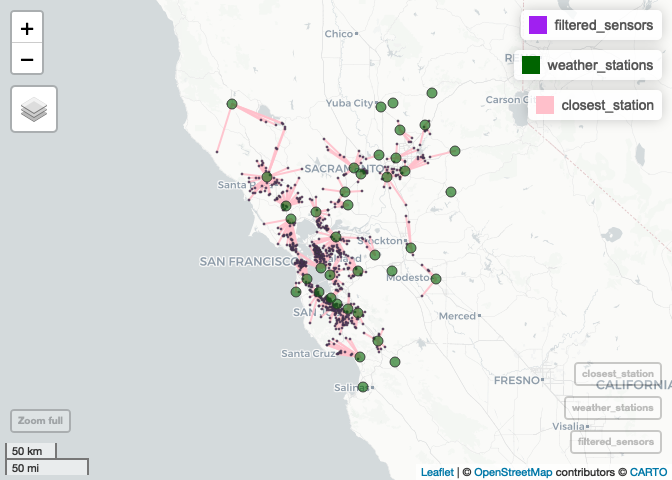

Data Preprocessing
================

# PurpleAir Sensors & Nearest Weather Station

## Load required libraries

``` r
library(dplyr) # For data manipulation
library(data.table) # Faster than dataframes (for big files)
library(sf) # For working with spatial data
library(mapview) # For interactive maps
library(lubridate) # Dates
library(purrr) 
```

## Read files

``` r
purpleair_data <- fread(paste0(purpleair_directory,"/purple_air_sanfran_2018-2019.csv"))
purpleair_sensors <- st_read(paste0(purpleair_directory, "/purpleair_sensors.gpkg"), quiet = TRUE)
weather_stations <- st_read(paste0(weather_directory, "/weather_stations.gpkg"), quiet = TRUE)
```

## Filter PurpleAir sensors

``` r
# filter purpleair_sensors for our selected data
filtered_sensors <- purpleair_sensors %>% 
  filter(sensor_index %in% unique(purpleair_data$sensor_index))
```

## Nearest Weather Stations

``` r
# Find the index of the nearest weather station for each sensor
nearest_station_index <- st_nearest_feature(filtered_sensors, weather_stations)

# Add nearest weather stations to purpleair data frame
filtered_sensors$weatherstation <- weather_stations$id[nearest_station_index]

st_write(filtered_sensors, 
         paste0(preprocessing_directory,"/pasensors_weatherstations.gpkg"),
         driver = "GPKG", append=FALSE)
```

    ## Deleting layer `pasensors_weatherstations' using driver `GPKG'
    ## Writing layer `pasensors_weatherstations' to data source 
    ##   `/Users/heba/Documents/GitHub/AirQualitySF/Preprocessing/pasensors_weatherstations.gpkg' using driver `GPKG'
    ## Writing 778 features with 2 fields and geometry type Point.

## Map PurpleAir Sensors and nearest Weather Stations

``` r
# Convert weather stations to a data frame
weather_stations_df <- as.data.frame(st_coordinates(weather_stations))
colnames(weather_stations_df) <- c("wlon", "wlat")
weather_stations_df$weatherstation <- weather_stations$id

# Convert filtered sensors to a data frame
filtered_sensors_df <- as.data.frame(st_coordinates(filtered_sensors))
colnames(filtered_sensors_df) <- c("plon", "plat")
filtered_sensors_df$sensor_index <- filtered_sensors$sensor_index
filtered_sensors_df$weatherstation <- filtered_sensors$weatherstation

# Join filtered sensors and weather stations data frames
result <- left_join(filtered_sensors_df, weather_stations_df, by = "weatherstation")

# Connect sensors with closest weather stations with lines
sensor_coords <- result[, c("plon", "plat")]
names(sensor_coords) <- c("long", "lat")
station_coords <- result[, c("wlon", "wlat")]
names(station_coords) <- c("long", "lat")

# Add lines as geometry
result$geometry <- do.call("c", lapply(seq(nrow(sensor_coords)), function(i) {
  st_sfc(st_linestring(as.matrix(rbind(sensor_coords[i, ], station_coords[i, ]))), crs = 4326)
}))

# Convert the result to a simple feature object
closest_station <- st_as_sf(result)

# Create map views
m1 <- mapview(filtered_sensors, col.regions = "purple", cex = 1)
m2 <- mapview(weather_stations, col.regions = "darkgreen", cex = 5)
m3 <- mapview(closest_station, color = "pink")

# Combine map views
m1 + m2 + m3
```

<!-- -->
