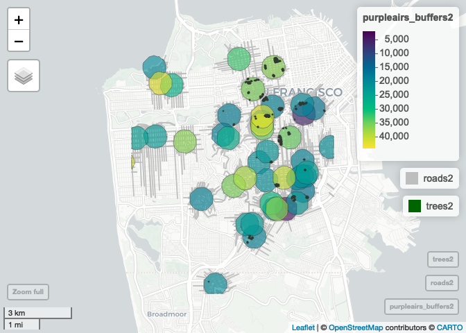

Data Preprocessing2
================

# PurpleAir Sensors and OSM roads, buildings, trees

## Load required libraries

``` r
library(dplyr) # For data manipulation
library(data.table) # Faster than dataframes (for big files)
library(sf) # For working with spatial data
library(mapview) # For interactive maps
library(lubridate) # Dates
library(purrr) 
```

## Read files

``` r
purpleair_data <- fread(paste0(purpleair_directory,"/purple_air_sanfran_2018-2019.csv"))
purpleair_sensors <- st_read(paste0(purpleair_directory, "/purpleair_sensors.gpkg"), quiet = TRUE)
```

## Filter PurpleAir sensors

``` r
# filter purpleair_sensors for our selected data
filtered_sensors <- purpleair_sensors %>% 
  filter(sensor_index %in% unique(purpleair_data$sensor_index))
```

## Create Buffers around Purple Air Sensors

``` r
# buffer radius in meters
buffer = 500
purpleairs_buffers <- st_buffer(filtered_sensors, dist=buffer)
```

## Read files

``` r
osm_roads <- st_read(paste0(osm_directory, "/sanfrangrid_roads_osm.gpkg"), quiet = TRUE)
osm_buildings <- st_read(paste0(osm_directory, "/sanfrangrid_buildings_osm.gpkg"), quiet = TRUE)
osm_trees <- st_read(paste0(osm_directory, "/sanfrangrid_trees_osm.gpkg"), quiet = TRUE)
```

## Get intersections of PurpleAir buffers and OSM roads, buildings, trees

``` r
# intersect keeps original geometry of item, just returns which items overlap
# intersection cuts geometry to be contained by buffer zone (only includes overlapping parts)
# intersection returns both objects joined

# function to get intersections using st_intersects
intersection_osm_buffers <- function(purpleairs_buffers, osm_data) {
  osm_intersections <- st_intersects(osm_data, purpleairs_buffers)
  osm_filtered <- filter(osm_data, purrr::map_lgl(osm_intersections, ~!purrr::is_empty(.x)))
  intersections <- st_intersects(purpleairs_buffers, osm_filtered)

  result <- list()
  for (i in seq_along(intersections)) {
    osm_i <- intersections[[i]]
    for (o in osm_i) {
      osm = osm_filtered[o,]
      sensor = purpleairs_buffers[i,]
      osm$sensor_index <- sensor$sensor_index
      result <- c(result, list(osm))
    }
  }
  result_df <- do.call(rbind, result)
  return(result_df)
}

# roads & purple air intersections
roads <- intersection_osm_buffers(purpleairs_buffers, osm_roads)
st_write(roads, paste0(preprocessing_directory, "/roads.gpkg"), driver = "GPKG", append=FALSE)

# trees & purple air intersections
trees <- intersection_osm_buffers(purpleairs_buffers, osm_trees)
st_write(trees, paste0(preprocessing_directory, "/trees.gpkg"), driver = "GPKG", append=FALSE)

# buildings & purple air intersections
buildings <- intersection_osm_buffers(purpleairs_buffers, osm_buildings)
st_write(buildings, paste0(preprocessing_directory, "/buildings.gpkg"), driver = "GPKG", append=FALSE)
```

## Map buffers with OSM roads, buildings, trees

``` r
roads <- st_read(paste0(preprocessing_directory, "/roads.gpkg"), quiet = TRUE)
trees <- st_read(paste0(preprocessing_directory, "/trees.gpkg"), quiet = TRUE)
# mapview(purpleairs_buffers) + mapview(roads) + mapview(trees)

# crop to smaller area of san fran
crs = 4326
bbox <- c(xmin = -122.50, ymin = 37.80, xmax = -122.40, ymax = 37.70)
bbox_polygon <- st_as_sfc(st_bbox(bbox))
st_crs(bbox_polygon) <- crs
purpleairs_buffers2 <- st_intersection(purpleairs_buffers, bbox_polygon)
```

    ## Warning: attribute variables are assumed to be spatially constant throughout
    ## all geometries

``` r
trees2 <- st_intersection(trees, bbox_polygon)
```

    ## Warning: attribute variables are assumed to be spatially constant throughout
    ## all geometries

``` r
roads2 <- st_intersection(roads, bbox_polygon)
```

    ## Warning: attribute variables are assumed to be spatially constant throughout
    ## all geometries

``` r
# Create map views
m1 <- mapview(purpleairs_buffers2)
m2 <- mapview(roads2, color = "grey")
m3 <- mapview(trees2, col.regions = "darkgreen", cex = 1)

# Combine map views
m1 + m2 + m3
```

<!-- -->
