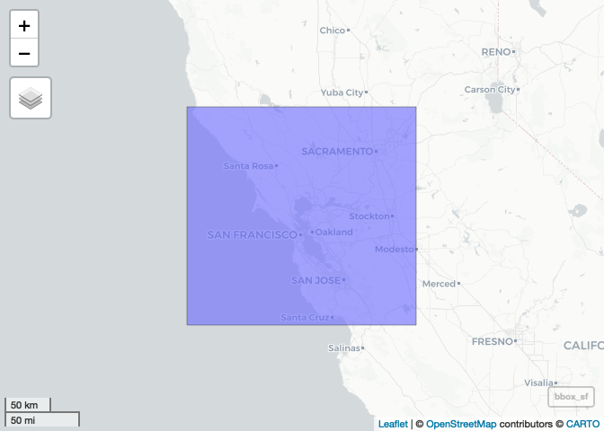
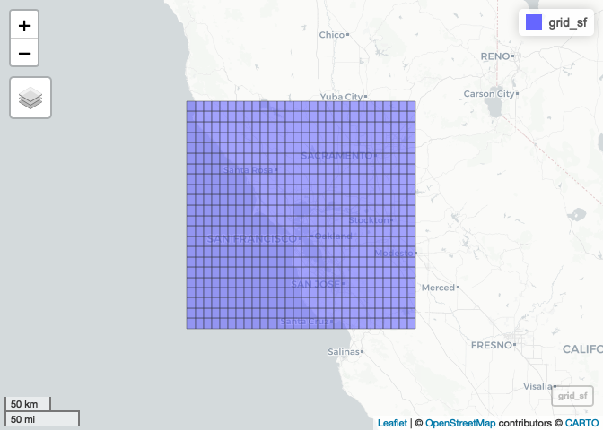
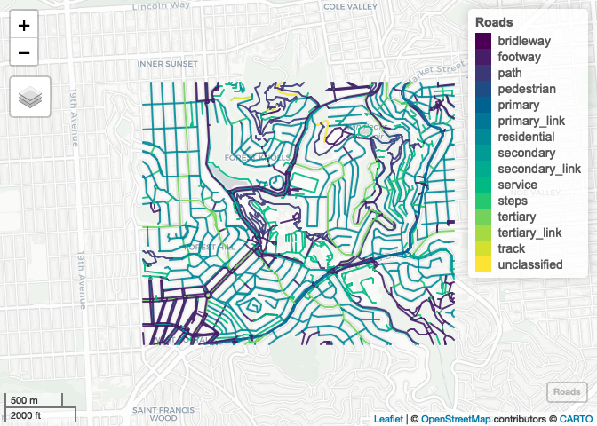
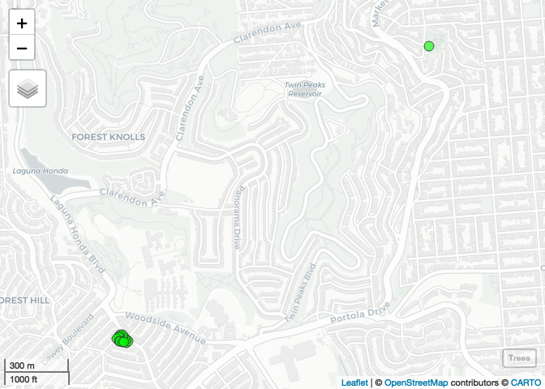

Download OSM data
================

``` r
suppressPackageStartupMessages({
  library(dplyr) # For data manipulation
  library(sf) # For working with spatial data
  library(mapview) # For interactive maps
  library(osmdata) # Open Street Map
  library(data.table)
  library(ggplot2)
})
```

## Bounding box of San Francisco and surrounding areas

``` r
# Greater san fran area
bbox <- c(xmin = -123.8, ymin = 36.9, xmax = -121.0, ymax = 39.0)

# Shapefile
bbox_sf <- st_as_sfc(st_bbox(bbox))

# Set CRS (coordinate reference system)
crs = 4326
st_crs(bbox_sf) <- crs

# view map
mapview(bbox_sf)
```

<!-- -->

# Split map into smaller areas

``` r
# make polygon into grid with cell size 0.1 x 0.1
grid <- st_make_grid(bbox_sf, cellsize = c(0.1,0.1))

grid_sf <- st_sf(geometry = grid)

# Display map of grid
mapview(grid_sf)
```

    ## Warning in cbind(`Feature ID` = fid, mat): number of rows of result is not a
    ## multiple of vector length (arg 1)

<!-- -->

# Download roads for each grid cell

``` r
# Loop through each location to get the bounding box and OSM data
for (i in 1:length(grid)) {
  print(i)
  
  output_name <- paste0('grid',i)
  
  osm <- opq(bbox = grid[i]) %>%
    add_osm_feature(key = 'highway') %>%
    osmdata_sf()
  
  # if cell is on empty location skip it
  if (is.null(osm$osm_lines)) {
    next
  }
  
  # Select only the columns you want to keep (if any col doesnt exist fill with NA)
  # if column osm_id is missing fill it with rownames
  if(!"osm_id" %in% names(osm$osm_lines)) {
    osm$osm_lines$osm_id <- rownames(osm$osm_lines)
  }
  # if column name is missing fill it with NA
  if(!"name" %in% names(osm$osm_lines)) {
    osm$osm_lines$name <- NA
  }  
  # if column highway is missing fill it with NA
  if(!"highway" %in% names(osm$osm_lines)) {
    osm$osm_lines$highway <- NA
  }  
  # if column lanes is missing fill it with NA
  if(!"lanes" %in% names(osm$osm_lines)) {
    osm$osm_lines$lanes <- NA
  }
  # if column maxspeed is missing fill it with NA
  if(!"maxspeed" %in% names(osm$osm_lines)) {
    osm$osm_lines$maxspeed <- NA
  }
  
  selected_columns <- osm$osm_lines %>% select(osm_id, name, highway, lanes, maxspeed)

  # Create an sf object
  sf_obj <- st_as_sf(selected_columns)
  
  # Save the sf object as a shapefile
  st_write(sf_obj, paste0(output_name, "_roads_osm.shp"), driver = "GPKG", append=FALSE)
}
```

## Read each grid roads and save to one file

``` r
# Get a list of file paths
file_paths <- list.files(pattern = "^grid.*_roads_osm\\.shp$", full.names = TRUE)

# Read all shapefiles into a list
sf_list <- lapply(file_paths, st_read)

# Merge the spatial objects
merged_sf <- do.call(rbind, sf_list)

# # Remove duplicates based on the 'osm_id' column
# merged_sf <- merged_sf %>% distinct(osm_id, .keep_all = TRUE)

# Write the merged spatial object to a new shapefile
st_write(merged_sf, "sanfrangrid_roads_osm.shp", driver = "GPKG", append=FALSE)
```

# Download buildings for each grid cell

``` r
# Loop through each location to get the bounding box and OSM data
for (i in 1:length(grid)) {
  print(i)
  
  output_name <- paste0('grid',i)
  
  osm <- opq(bbox = grid[i]) %>%
    add_osm_feature(key = 'building') %>%
    osmdata_sf()
  
  # if cell was on an empty location
  if (is.null(osm$osm_polygons) || nrow(osm$osm_polygons) == 0) {
    next
  }
  
  # Select only the columns you want to keep (if any col doesnt exist fill with NA)
  
  # if column osm_id is missing fill it with rownames
  if(!"osm_id" %in% names(osm$osm_polygons)) {
    osm$osm_polygons$osm_id <- rownames(osm$osm_polygons)
  }
  # if column name is missing fill it with NA
  if(!"name" %in% names(osm$osm_polygons)) {
    osm$osm_polygons$name <- NA
  }  
  # if column building is missing fill it with NA
  if(!"building" %in% names(osm$osm_polygons)) {
    osm$osm_polygons$building <- NA
  }  
  # if column amenity is missing fill it with NA
  if(!"amenity" %in% names(osm$osm_polygons)) {
    osm$osm_polygons$amenity <- NA
  }
  
  selected_columns <- osm$osm_polygons %>% select(osm_id, name, building, amenity)

  # Create an sf object
  sf_obj <- st_as_sf(selected_columns)
  
  # Save the sf object as a shapefile
  st_write(sf_obj, paste0(output_name, "_buildings_osm.gpkg"), driver = "GPKG", append=FALSE)
}
```

## Read smaller building grid areas and save to one file

``` r
# Get a list of file paths
file_paths <- list.files(pattern = "^grid.*_buildings_osm\\.gpkg$", full.names = TRUE)

# Read all shapefiles into a list
sf_list <- lapply(file_paths, st_read)

# Merge the spatial objects
merged_sf <- do.call(rbind, sf_list)

# # Remove duplicates based on the 'osm_id' column
# merged_sf <- merged_sf %>% distinct(osm_id, .keep_all = TRUE)

# Write the merged spatial object to a new shapefile
st_write(merged_sf, "sanfrangrid_buildings_osm.gpkg", driver = "GPKG", append=FALSE)
```

# Download trees for each grid cell

``` r
# Loop through each location to get the bounding box and OSM data
for (i in 1:length(grid)) {
  print(i)
  
  output_name <- paste0('grid',i)
  
  osm <- opq(bbox = grid[i]) %>%
    add_osm_feature(key = 'natural') %>%
    osmdata_sf()
  
  tree_points <- osm$osm_points[!is.na(osm$osm_points$natural), ]
  tree_points <- tree_points[tree_points$natural == "tree", ]
  
  # if cell was on an empty location
  if (is.null(tree_points) || nrow(tree_points) == 0) {
    next
  }
  
  # Select only the columns you want to keep (if any col doesnt exist fill with NA)
  
  # if column osm_id is missing fill it with rownames
  if(!"osm_id" %in% names(tree_points)) {
    tree_points$osm_id <- rownames(tree_points)
  }
  
  selected_columns <- tree_points %>% select(osm_id)

  # Create an sf object
  sf_obj <- st_as_sf(selected_columns)
  
  # Save the sf object as a shapefile
  st_write(sf_obj, paste0(output_name, "_trees_osm.gpkg"), driver = "GPKG", append=FALSE)
}
```

## Read smaller trees grid areas and save to one file

``` r
# Get a list of file paths
file_paths <- list.files(pattern = "^grid.*_trees_osm\\.gpkg$", full.names = TRUE)

# Read all shapefiles into a list
sf_list <- lapply(file_paths, st_read)

# Merge the spatial objects
merged_sf <- do.call(rbind, sf_list)

# Write the merged spatial object to a new shapefile
st_write(merged_sf, "sanfrangrid_trees_osm.gpkg", driver = "GPKG", append=FALSE)
```

## Read merged osm files

``` r
# read roads file
sanfrangrid_roads <- st_read("sanfrangrid_roads_osm.shp", quiet = TRUE)

# read buildings file
sanfrangrid_buildings <- st_read("sanfrangrid_buildings_osm.gpkg", quiet = TRUE)

# read trees file
sanfrangrid_trees <- st_read("sanfrangrid_trees_osm.gpkg", quiet = TRUE)
```

## Plot roads

``` r
ggplot(sanfrangrid_roads) + geom_sf()
```

<!-- -->

## Plot buildings

``` r
ggplot(sanfrangrid_buildings) + geom_sf()
```

<!-- -->

## Plot trees

``` r
ggplot(sanfrangrid_trees) + geom_sf()
```

<!-- -->

# Read roads, buildings, trees for San Fran city (cell 238)

``` r
# read roads file
sanfrancell_roads <- st_read("grid238_roads_osm.shp", quiet = TRUE)

# read buildings file
sanfrancell_buildings <- st_read("grid238_buildings_osm.gpkg", quiet = TRUE)

# read trees file
sanfrancell_trees <- st_read("grid238_trees_osm.gpkg", quiet = TRUE)
```

## Select small area of San Francisco to map

``` r
crs = 4326
bbox <- c(xmin = -122.47, ymin = 37.76, xmax = -122.44, ymax = 37.74)
bbox_polygon <- st_as_sfc(st_bbox(bbox))
st_crs(bbox_polygon) <- crs
st_crs(sanfrancell_buildings) <- crs
sanfrancell_roads <- st_intersection(sanfrancell_roads, bbox_polygon)
sanfrancell_buildings <- st_intersection(sanfrancell_buildings, bbox_polygon)
sanfrancell_trees <- st_intersection(sanfrancell_trees, bbox_polygon)
```

## Map of San Fran roads

``` r
mapview(sanfrancell_roads, layer.name = "Roads",  zcol = "highway")
```

<!-- -->

## Map of San Fran buildings

``` r
simplified_buildings <- st_simplify(sanfrancell_buildings, dTolerance = 0.001)
mapview(simplified_buildings, map.types="CartoDB.Positron", layer.name = "Buildings", zcol = "building")
```

<!-- -->

## Map of San Fran trees

``` r
mapview(sanfrancell_trees, col.regions = "green", legend = FALSE, layer.name = "Trees")
```

<!-- -->
