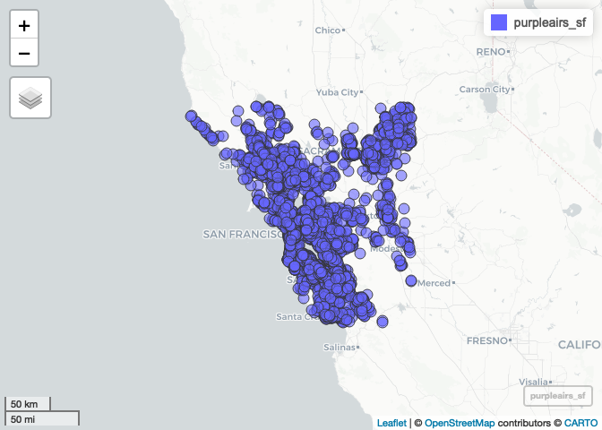
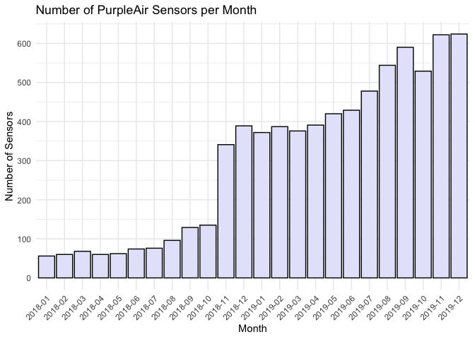

# Download PurpleAir Data

## Load required libraries

``` r
library(dplyr) # For data manipulation
library(sf) # For working with spatial data
library(mapview) # For interactive maps
library(ggplot2) # For visualizing data
library(lubridate) # For working with dates

# install package from github
library(devtools)
suppressMessages({devtools::install_github("heba-razzak/getPurpleairApiHistoryV2")})
library(getPurpleairApiHistoryV2)
```

# Download purple air sensor id, lat, lon, date created, last seen

``` r
pa <- getPurpleairSensors(apiReadKey = auth_key)

# CRS (coordinate reference system)
crs = 4326

# Convert the PurpleAir data frame to an sf object
pa <- pa %>% na.omit() 
dt <- st_as_sf(pa, coords=c("longitude", "latitude"), crs = crs)
head(dt)
```

```         
## Simple feature collection with 6 features and 3 fields
## Geometry type: POINT
## Dimension:     XY
## Bounding box:  xmin: -124.1288 ymin: 39.43402 xmax: -104.7324 ymax: 49.16008
## Geodetic CRS:  WGS 84
##   sensor_index date_created  last_seen                   geometry
## 1           53   2016-02-04 2024-03-20 POINT (-111.7048 40.24674)
## 2           77   2016-03-02 2024-03-20 POINT (-111.8253 40.75082)
## 3           81   2016-06-11 2024-03-20 POINT (-111.6424 40.28764)
## 4          182   2016-08-01 2024-03-20 POINT (-123.7423 49.16008)
## 5          195   2016-08-01 2024-03-20    POINT (-124.1288 41.06)
## 6          314   2016-09-15 2024-03-20 POINT (-104.7324 39.43402)
```

# Get purple air sensors in san fran area (using bounding box)

``` r
# Greater san fran area
bbox <- c(xmin = -123.8, ymin = 36.9, xmax = -121.0, ymax = 39.0)

# Shapefile of bounding box
bbox_sf <- st_as_sfc(st_bbox(bbox))

# Set CRS (coordinate reference system)
crs = 4326
st_crs(bbox_sf) <- crs

# intersection of purple air sensors and bounding box
purpleairs_sf <- st_intersection(dt, bbox_sf)

# interactive map
mapview(purpleairs_sf)
```

<!-- -->

## number of sensors

``` r
cat("Total number of sensors: ", length(unique(purpleairs_sf$sensor_index)))
```

```         
## Total number of sensors:  7484
```

``` r
# Inputs for purple air function
apiReadKey <- auth_key
fields <- c("pm2.5_atm, pm2.5_atm_a, pm2.5_atm_b")
average <- "60"
```

``` r
# Date range of historical purple air data
start_date <- as.Date("2019-08-01")
  end_date <- as.Date("2019-12-31")
current_date <- start_date
```

``` r
# Iterate over each 1 month period
while (current_date <= end_date) {
  
  next_date <- current_date + months(1) - days(1)
  
  # Ensure we don't go beyond the end date
  if (next_date > end_date) {
    next_date <- end_date
  }
  
  # Print the dates we're processing
  print(paste("Processing:", current_date, "-", next_date))
  start_time <- Sys.time()
  
  filtered_purpleairs_sf <- purpleairs_sf %>% filter(last_seen >= current_date) %>% filter(date_created <= next_date)
  sensorIndex <- unique(filtered_purpleairs_sf$sensor_index)
  
  # Get the data
  purple_air <- getPurpleairApiHistoryV2(
    sensorIndex=sensorIndex,
    apiReadKey=apiReadKey,
    startDate=current_date,
    endDate=next_date,
    average=average,
    fields=fields
  )
  
  # Save to CSV file
  write.csv(purple_air, file = paste0("purple_air_sanfran_", current_date, "_", next_date, ".csv"), row.names = FALSE)
  
  # Print time it took
  end_time <- Sys.time()
  time_difference <- end_time - start_time
  print(paste("Processing time:", current_date, "-", next_date))
  print(time_difference)
  
  # Update the current date
  current_date <- next_date + days(1)
}
```

```         
## [1] "Processing: 2019-08-01 - 2019-08-31"
## [1] "Processing time: 2019-08-01 - 2019-08-31"
## Time difference of 1.214052 hours
## [1] "Processing: 2019-09-01 - 2019-09-30"
## [1] "Processing time: 2019-09-01 - 2019-09-30"
## Time difference of 1.326625 hours
## [1] "Processing: 2019-10-01 - 2019-10-31"
## [1] "Processing time: 2019-10-01 - 2019-10-31"
## Time difference of 1.352346 hours
## [1] "Processing: 2019-11-01 - 2019-11-30"
## [1] "Processing time: 2019-11-01 - 2019-11-30"
## Time difference of 1.458355 hours
## [1] "Processing: 2019-12-01 - 2019-12-31"
## [1] "Processing time: 2019-12-01 - 2019-12-31"
## Time difference of 1.485901 hours
```

``` r
head(purple_air)
```

```         
##              time_stamp pm2.5_atm pm2.5_atm_a pm2.5_atm_b sensor_index
## 299 2019-12-01 00:00:00    1.8025       2.639       0.966          767
## 298 2019-12-01 01:00:00    1.5510       2.204       0.898          767
## 304 2019-12-01 02:00:00    0.2915       0.539       0.044          767
## 133 2019-12-01 03:00:00    1.3010       1.825       0.777          767
## 303 2019-12-01 04:00:00    0.8570       1.335       0.379          767
## 306 2019-12-01 05:00:00    8.3655      10.362       6.369          767
```

``` r
# Get a list of file paths
file_paths <- list.files(file_directory, pattern = "purple_air_sanfran_.*.csv", full.names = FALSE)

# Read files
dfs <- lapply(file_paths, read.csv)

# Bind to 1 dataframe
fulldata <- do.call(rbind, dfs)

# initialize from and to
from = "9999-99-99"
to = "0000-00-00"

for (f in file_paths) {
  from = min(from,substr(f,20,29))
  to = max(to,substr(f,31,40))
}

# Save full df to csv
write.csv(fulldata, file = paste0("purple_air_sanfran_", from, "_", to, ".csv"), row.names = FALSE)
```

``` r
# Read purple air data (get filename for full data then read it)
file_paths <- list.files(file_directory, pattern = "purple_air_sanfran_.*.csv", full.names = FALSE)
from = "9999-99-99"
to = "0000-00-00"
for (f in file_paths) {
  from = min(from,substr(f,20,29))
  to = max(to,substr(f,31,40))
}
fulldata <- read.csv(paste0("purple_air_sanfran_", from, "_", to, ".csv"))

# Add column for month
fulldata$month <- format(as.Date(fulldata$time_stamp), "%Y-%m")

# Sensors for each month
monthly_sensors <- fulldata %>% select(month, sensor_index) %>% distinct()
head(monthly_sensors)
```

```         
##     month sensor_index
## 1 2018-01          767
## 2 2018-01         1742
## 3 2018-01         1860
## 4 2018-01         1874
## 5 2018-01         2031
## 6 2018-01         2574
```

``` r
sensor_counts <- monthly_sensors %>%
  group_by(month) %>%
  summarise(sensor_count = n_distinct(sensor_index))

ggplot(sensor_counts, aes(x = month, y = sensor_count)) +
  geom_bar(stat = "identity", fill = "lavender", color = "black") +
  labs(title = "Number of PurpleAir Sensors per Month",
       x = "Month",
       y = "Number of Sensors") +
  scale_y_continuous(breaks = seq(0, max(sensor_counts$sensor_count) + 100, by = 100)) +
  theme_minimal() +
  theme(axis.text.x = element_text(angle = 45, hjust = 1))
```

<!-- -->
