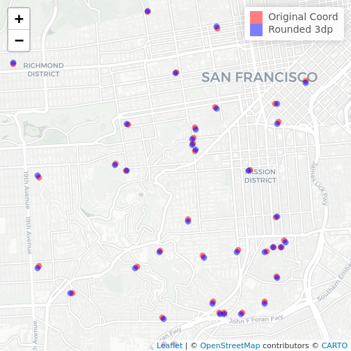
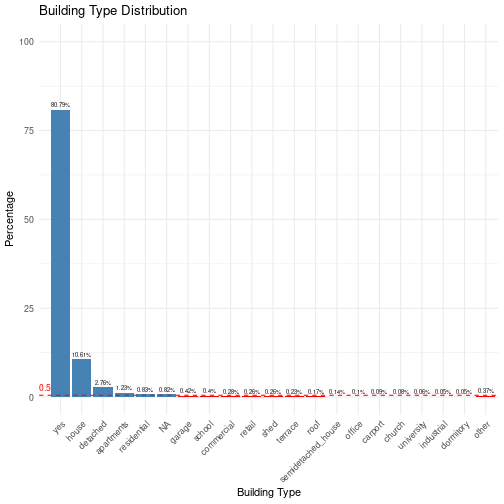
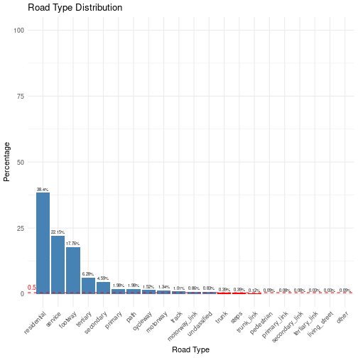
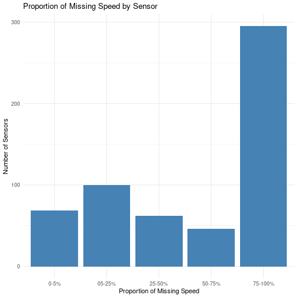
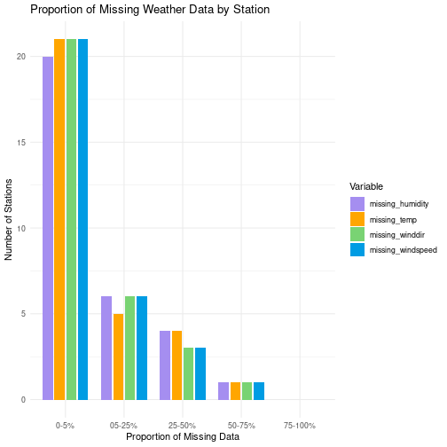

Feature Engineering
================

# Creating new features

Calculate building areas, road lengths, and number of trees surrounding
PurpleAir sensors. Create new columns to represent temporal aspects such
as day, hour, and weekend.

## Load required libraries

``` r
library(dplyr) # For data manipulation
library(data.table) # Faster than dataframes (for big files)
library(sf) # For working with spatial data
library(lubridate) # Dates
library(tidyr) # Pivot data
library(leaflet) # Interactive maps
library(ggplot2) # Plots
library(timeDate) # For holidays
```

## Read files

``` r
traffic_data <- fread(paste0(preprocessing_directory, "/traffic.csv"))
purpleair_data <- fread(paste0(preprocessing_directory,"/purpleair_filtered_2018-2019.csv"))
weather_data <- fread(paste0(preprocessing_directory,"/weather_filtered.csv"))
purpleair_sensors <- st_read(paste0(preprocessing_directory, "/pasensors_weatherstations.gpkg"), quiet = TRUE)
osm_roads <- st_read(paste0(osm_directory, "/bayarea_roads_osm.gpkg"), quiet = TRUE)
osm_trees <- st_read(paste0(osm_directory, "/bayarea_trees_osm.gpkg"), quiet = TRUE)
osm_buildings <- st_read(paste0(osm_directory, "/bayarea_buildings_osm.gpkg"), quiet = TRUE)
```

## Round sensor coordinates to 3 decimal places

``` r
# Round lat and lon
purpleair_sensors <- st_set_precision(purpleair_sensors, precision=1000)
st_write(purpleair_sensors, paste0(preprocessing_directory, "/pasensors_weatherstations3dp.gpkg"), append=FALSE, quiet = TRUE)
```

## Map difference in precision

``` r
purpleair_original <- st_read(paste0(preprocessing_directory, "/pasensors_weatherstations.gpkg"), quiet = TRUE)
purpleair_sensors <- st_read(paste0(preprocessing_directory, "/pasensors_weatherstations3dp.gpkg"), quiet = TRUE)

# Map difference in precision
leaflet() %>%
  addProviderTiles("CartoDB") %>% 
  addCircleMarkers(data = purpleair_original, color = "red",radius=2, label=purpleair_original$sensor_index) %>%
  addCircleMarkers(data = purpleair_sensors, color = "blue",radius=2, label=purpleair_sensors$sensor_index) %>% 
  addLegend(colors = c("red", "blue"), 
            labels = c("Original Coord", "Rounded 3dp")) %>% 
  setView(lng = -122.44, lat =  37.76, zoom = 13)
```

    ## Fontconfig warning: ignoring UTF-8: not a valid region tag

<figure>

<figcaption aria-hidden="true">plot of chunk map-3dp</figcaption>
</figure>

## Create cartesian coordinates for purple air sensors

``` r
# Create features to represent lat and lon
# https://medium.com/@manishsingh7163/converting-from-latitude-longitude-to-cartesian-coordinates-9ddf30841c45

# Extract coordinates
coords <- st_coordinates(purpleair_sensors)

# Convert coordinates from degrees to radians
lat_rad <- coords[, 2] * pi / 180
lon_rad <- coords[, 1] * pi / 180

# Calculate Cartesian coordinates
x <- cos(lat_rad) * cos(lon_rad)
y <- cos(lat_rad) * sin(lon_rad)
z <- sin(lat_rad)

# Add Cartesian coordinates as new columns to the purpleair_sensors data frame
purpleair_sensors <- purpleair_sensors %>%
  mutate(x = x, y = y, z = z) %>% 
  st_drop_geometry()
```

## Create final dataset temporal features

``` r
# Get holidays for 2018 and 2019
holidays <- as.Date(c(holidayNYSE(2019), holidayNYSE(2018)))

# Create temporal features
final_dataset <- purpleair_data %>%
  mutate(
    local_timestamp = with_tz(time_stamp, tzone = "America/Los_Angeles"),
    local_date = as.Date(local_timestamp, tz="America/Los_Angeles"),
    dow = lubridate::wday(local_timestamp),
    hour = lubridate::hour(local_timestamp),
    day = lubridate::day(local_timestamp),
    month = lubridate::month(local_timestamp),
    year = lubridate::year(local_timestamp),
    wknd = ifelse(dow %in% c(6, 7), 1, 0),
    holiday = ifelse(local_date %in% holidays, 1, 0)
  ) %>% select(-local_timestamp, -local_date)
```

## Calculate building areas for each PurpleAir sensor

``` r
# building areas in m^2
building_areas <- osm_buildings %>%
  select(sensor_index, building) %>%
  mutate(building = ifelse(is.na(building), "NA", building)) %>%
  group_by(sensor_index, building) %>%
  summarize(building_area = sum(st_area(geom)), .groups = 'drop') %>%
  st_drop_geometry()

# remove units from building_area
attributes(building_areas$building_area) = NULL

# round area
building_areas$building_area <- round(building_areas$building_area,2)

# Save building areas
fwrite(building_areas, paste0(preprocessing_directory,"/building_areas.csv"))
```

## Areas of building types for each PurpleAir sensor

``` r
# Read building areas
building_areas <- fread(paste0(preprocessing_directory,"/building_areas.csv"))

# pivot building types
building_areas <- building_areas %>%
  pivot_wider(names_from = building, 
              values_from = building_area, values_fill = list(building_area = 0))

# Calculate the total areas for each building type
total_areas <- building_areas %>%
  summarize(across(-sensor_index, sum)) %>%
  gather(building, total_area) %>%
  mutate(percentage = round(total_area / sum(total_area) * 100,2)) %>%
  arrange(desc(percentage))

# cutoff for building types: 0.5%
cutoff <- 0.5

# Number of buildings above cutoff
n_relevant <- total_areas %>%
  filter(percentage > cutoff) %>% nrow()

# Number of building types to show in plot
n <- 20

# top n building types for plot (descending by percentage with other at the end)
top_n <- total_areas %>% arrange(desc(percentage)) %>% top_n(n, percentage)
top_n_counts <- total_areas %>%
  mutate(building = ifelse(building %in% top_n$building, building, 'other')) %>% 
  group_by(building) %>% summarise(total_area = sum(total_area), percentage = sum(percentage),  .groups = 'drop') %>%
  arrange(desc(percentage)) %>%
  mutate(building = factor(building, levels = c(setdiff(unique(building), "other"), "other"))) %>%
  arrange(building)

# Bar plot showing building type distribution
building_dist <- ggplot(top_n_counts,
       aes(x = building, y = percentage, fill=building)) +
  geom_bar(stat = "identity") +
  geom_hline(yintercept = cutoff, linetype = "dashed", color = "red") +
  labs(title = "Building Type Distribution (By Area)", 
       x = "Building Type", y = "Percentage") +
  theme_minimal() +
  geom_text(aes(label = paste0(round(percentage, 2),"%")), vjust = -0.5, size = 2) +
  theme(axis.text.x = element_text(angle = 45, hjust = 1), legend.position = "none") +
  scale_y_continuous(limits = c(0, 100)) +
  scale_fill_manual(values = c(rep("steelblue", n_relevant), rep("red", n-n_relevant+1))) +
  annotate("text", x = 0, y = cutoff, label = "0.5", color = "red", hjust = 0, vjust=-0.6, size = 3)

building_dist
```

<figure>

<figcaption aria-hidden="true">plot of chunk building-dist</figcaption>
</figure>

## Buildings area data

``` r
# add prefix for building columns
total_areas <- total_areas %>% mutate(building = paste0("b_", building))
building_areas <- building_areas %>%
  rename_with(~ paste0("b_", .), -sensor_index)

# Select building types with a percentage larger than the cutoff (0.5%)
relevant_buildings <- total_areas %>%
  filter(percentage > cutoff) %>%
  pull(building)

# Create the b_others column by summing the counts of less relevant building types
building_areas <- building_areas %>%
  mutate(b_other = rowSums(select(., -sensor_index, -one_of(relevant_buildings)))) %>%
  select(sensor_index, all_of(relevant_buildings), b_other)

# Merge building counts with final_dataset
final_dataset <- final_dataset %>%
  left_join(building_areas, by = "sensor_index") %>%
  mutate(across(starts_with("b_"), ~ replace_na(.x, 0)))
```

## Calculate road lengths for each PurpleAir sensor

``` r
# Calculate road lengths
road_lengths <- osm_roads %>%
  select(sensor_index, highway) %>%
  mutate(highway = ifelse(is.na(highway), "NA", highway)) %>%
  group_by(sensor_index, highway) %>%
  summarize(road_length = sum(st_length(geom)), .groups = 'drop') %>%
  st_drop_geometry()
  
# remove units from road_length
attributes(road_lengths$road_length) = NULL

# round length
road_lengths$road_length <- round(road_lengths$road_length,2)

# Save road lengths
fwrite(road_lengths, paste0(preprocessing_directory,"/road_lengths.csv"))
```

## Length of road types for each PurpleAir sensor

``` r
# Read road lengths
road_lengths <- fread(paste0(preprocessing_directory,"/road_lengths.csv"))

# Pivot road lengths
road_lengths <- road_lengths %>% 
  pivot_wider(names_from = highway, 
              values_from = road_length, values_fill = list(road_length = 0))

# Calculate the total lengths for each road type
total_lengths <- road_lengths %>%
  summarize(across(-sensor_index, sum)) %>%
  gather(highway, total_length) %>%
  mutate(percentage = total_length / sum(total_length) * 100) %>%
  arrange(desc(percentage))

# cutoff for road types: 0.5%
cutoff <- 0.5

# Number of roads above cutoff
n_relevant <- total_lengths %>%
  filter(percentage > cutoff) %>% nrow()

# Number of road types to show in plot
n <- 20

# top n road types for plot (descending by percentage with other at the end)
top_n <- total_lengths %>% arrange(desc(percentage)) %>% top_n(n, percentage)
top_n_counts <- total_lengths %>%
  mutate(highway = ifelse(highway %in% top_n$highway, highway, 'other')) %>% 
  group_by(highway) %>% summarise(total_length = sum(total_length), percentage = sum(percentage),  .groups = 'drop') %>%
  arrange(desc(percentage)) %>%
  mutate(highway = factor(highway, levels = c(setdiff(unique(highway), "other"), "other"))) %>%
  arrange(highway)

# Bar plot showing road type distribution
road_dist <- ggplot(top_n_counts,
       aes(x = highway, y = percentage, fill=highway)) +
  geom_bar(stat = "identity") +
  geom_hline(yintercept = cutoff, linetype = "dashed", color = "red") +
  labs(title = "Road Type Distribution", 
       x = "Road Type", y = "Percentage") +
  theme_minimal() +
  geom_text(aes(label = paste0(round(percentage, 2),"%")), vjust = -0.5, size = 2) +
  theme(axis.text.x = element_text(angle = 45, hjust = 1), legend.position = "none") +
  scale_y_continuous(limits = c(0, 100)) +
  scale_fill_manual(values = c(rep("steelblue", n_relevant), rep("red", n-n_relevant+1))) +
  annotate("text", x = 0, y = cutoff, label = "0.5", color = "red", hjust = 0, vjust=-0.6, size = 3)

road_dist
```

<figure>

<figcaption aria-hidden="true">plot of chunk roads-dist</figcaption>
</figure>

## Road length data

``` r
# add prefix for road columns
total_lengths <- total_lengths %>% mutate(highway = paste0("r_", highway))
road_lengths <- road_lengths %>%
  rename_with(~ paste0("r_", .), -sensor_index)

# Select road types with a percentage larger than the cutoff (0.5%)
relevant_roads <- total_lengths %>%
  filter(percentage > cutoff) %>%
  pull(highway)

# Create the b_others column by summing the counts of less relevant road types
road_lengths <- road_lengths %>%
  mutate(r_other = rowSums(select(., -sensor_index, -one_of(relevant_roads)))) %>%
  select(sensor_index, all_of(relevant_roads), r_other)

# Merge road lengths with final_dataset
final_dataset <- final_dataset %>%
  left_join(road_lengths, by = "sensor_index") %>% 
  mutate(across(starts_with("r_"), ~ replace_na(.x, 0)))
```

## Calculate num trees for each PurpleAir sensor

``` r
# Drop geometry and calculate tree counts
tree_counts <- osm_trees %>% st_drop_geometry() %>%
  select(sensor_index) %>%
  group_by(sensor_index) %>%
  summarize(num_trees = n(), .groups = 'drop')

# Save tree counts
fwrite(tree_counts, paste0(preprocessing_directory,"/tree_counts.csv"))
```

``` r
# Read trees counts
tree_counts <- fread(paste0(preprocessing_directory,"/tree_counts.csv"))

# Merge tree counts with final_dataset
final_dataset <- final_dataset %>%
  left_join(tree_counts, by = "sensor_index") %>% 
  mutate(num_trees = replace_na(num_trees, 0))
```

## Traffic preprocessing

``` r
# Get associated purpleair sensors and roads
sensor_roads <- osm_roads %>% 
  select(sensor_index, osm_id, highway) %>% 
  mutate(osm_id = as.integer(osm_id)) %>%
  st_drop_geometry() %>% 
  distinct()

# Group "other" road types together
sensor_roads <- sensor_roads %>%
  mutate(highway = if_else(paste0("r_",highway) %in% relevant_roads, highway, "other"))

# Drop free flow speed since we have the speed and congestion ratio 
traffic_data <- traffic_data %>% select(-free_flow_speed)

# Join traffic data with sensors and roads
traffic_sensors <- sensor_roads %>%
  inner_join(traffic_data, by = c("osm_id" = "osm_way_id"))
```

    ## Warning in inner_join(., traffic_data, by = c(osm_id = "osm_way_id")): Detected an unexpected many-to-many relationship between `x` and `y`.
    ## i Row 1 of `x` matches multiple rows in `y`.
    ## i Row 7292133 of `y` matches multiple rows in `x`.
    ## i If a many-to-many relationship is expected, set `relationship =
    ##   "many-to-many"` to silence this warning.

``` r
# Aggregate traffic data by sensor, highway and timestamp
traffic_agg <- traffic_sensors %>%
  group_by(sensor_index, highway, utc_timestamp) %>%
  summarize(
    mean_speed = mean(speed_mph_mean, na.rm = TRUE),
    median_speed = median(speed_mph_mean, na.rm = TRUE),
    mean_congestion = mean(congestion_ratio, na.rm = TRUE),
    median_congestion = median(congestion_ratio, na.rm = TRUE),
    .groups = 'drop'
  )

# Pivot the data for all relevant columns
traffic_agg <- traffic_agg %>% 
  pivot_wider(names_from = highway, 
              values_from = c(mean_speed, median_speed, mean_congestion, median_congestion),
              names_sep = "_")

# Save traffic agg
fwrite(traffic_agg, paste0(preprocessing_directory,"/traffic_agg.csv"))

# Merge traffic data with final dataset
final_dataset <- final_dataset %>%
  left_join(traffic_agg, by = c("time_stamp" = "utc_timestamp", "sensor_index" = "sensor_index"))
```

## Full timeseries traffic data

``` r
# NOT USING IMPUTATION - Link just for reference #
# Seasonal Trend Decomposition using Loess (STL) Imputation
# https://medium.com/@aaabulkhair/data-imputation-demystified-time-series-data-69bc9c798cb7

# Define the range of your timestamps
start_time <- min(final_dataset$time_stamp, na.rm = TRUE)
end_time <- max(final_dataset$time_stamp, na.rm = TRUE)

# Generate a sequence of all possible hourly timestamps within the range
all_timestamps <- seq(from = start_time, to = end_time, by = "hour")

# Get all unique sensor_index values
all_sensor_indices <- unique(traffic_agg$sensor_index)

# Create a complete time series for each sensor_index
complete_time_series <- expand.grid(sensor_index = all_sensor_indices,
                                    utc_timestamp = all_timestamps)

# Join with your existing data
traffic_complete <- complete_time_series %>%
  left_join(traffic_agg, by = c("sensor_index", "utc_timestamp"))

# Arrange data
traffic_complete <- traffic_complete %>% arrange(sensor_index, utc_timestamp)
```

## Plot showing missing speed data

``` r
# Aggregate missing speed by sensors

missing_speeds <- traffic_complete %>%
  mutate(missing_speed = ifelse(if_all(starts_with("mean_speed"), is.na), 1, 0)) %>%
  group_by(sensor_index) %>%
  summarize(
    missing_percentage = 100 * round(sum(missing_speed) / n(), 3),
    .groups = 'drop'
  ) %>% 
  summarize(
    "0-5%" = sum(ifelse(missing_percentage >= 0 & missing_percentage < 5,1,0)),
    "05-25%" = sum(ifelse(missing_percentage >= 5 & missing_percentage < 25,1,0)),
    "25-50%" = sum(ifelse(missing_percentage >= 25 & missing_percentage < 50,1,0)),
    "50-75%" = sum(ifelse(missing_percentage >= 50 & missing_percentage < 75,1,0)),
    "75-100%" = sum(ifelse(missing_percentage >= 75 & missing_percentage <= 100,1,0)),
    .groups = 'drop'
    ) %>% 
  pivot_longer(cols = ends_with("%"), names_to = "range", values_to = "count")

# Plot the aggregated data
ggplot(missing_speeds, aes(x = range, y = count)) +
  geom_bar(stat = "identity", fill = "steelblue") +
  labs(title = "Proportion of Missing Speed by Sensor",
       x = "Proportion of Missing Speed",
       y = "Number of Sensors") +
  theme_minimal()
```

<figure>

<figcaption aria-hidden="true">plot of chunk
missing-speed-plot</figcaption>
</figure>

## Weather preprocessing

``` r
# Define the range of your timestamps
start_time <- min(final_dataset$time_stamp, na.rm = TRUE)
end_time <- max(final_dataset$time_stamp, na.rm = TRUE)

# Generate a sequence of all possible hourly timestamps within the range
all_timestamps <- seq(from = start_time, to = end_time, by = "hour")

# Get all unique station values
all_station_indices <- unique(weather_data$station)

# Create a complete time series for each station
complete_time_series <- expand.grid(station = all_station_indices,
                                    timestamp = all_timestamps)

# Join with your existing data
weather_complete <- complete_time_series %>%
  left_join(weather_data, by = c("station", "timestamp"))

# Arrange data
weather_complete <- weather_complete %>% select(-lon, -lat) %>% arrange(station, timestamp)
```

## Plot showing missing weather data

``` r
# Aggregate missing weather by sensors
missing_weather <- weather_complete %>%
  mutate(
    missing_temp = ifelse(is.na(temp_fahrenheit), 1, 0),
    missing_humidity = ifelse(is.na(rel_humidity), 1, 0),
    missing_winddir = ifelse(is.na(wind_direction), 1, 0),
    missing_windspeed = ifelse(is.na(wind_speed), 1, 0)
  ) %>%
  group_by(station) %>%
  summarize(
    missing_temp = 100 * sum(missing_temp) / n(),
    missing_humidity = 100 * sum(missing_humidity) / n(),
    missing_winddir = 100 * sum(missing_winddir) / n(),
    missing_windspeed = 100 * sum(missing_windspeed) / n(),
    .groups = 'drop'
  ) %>%
  pivot_longer(cols = starts_with("missing"), names_to = "variable", values_to = "missing_percentage") %>%
  group_by(variable) %>%
  summarize(
    "0-5%" = sum(ifelse(missing_percentage >= 0 & missing_percentage < 5,1,0)),
    "05-25%" = sum(ifelse(missing_percentage >= 5 & missing_percentage < 25,1,0)),
    "25-50%" = sum(ifelse(missing_percentage >= 25 & missing_percentage < 50,1,0)),
    "50-75%" = sum(ifelse(missing_percentage >= 50 & missing_percentage < 75,1,0)),
    "75-100%" = sum(ifelse(missing_percentage >= 75 & missing_percentage <= 100,1,0)),
    .groups = 'drop'
    ) %>%
  pivot_longer(cols = ends_with("%"), names_to = "range", values_to = "count")

# Plot
ggplot(missing_weather, aes(x = range, y = count, fill = variable)) +
  geom_bar(stat = "identity", position = position_dodge(width = 0.8), width = 0.7) +
  labs(title = "Proportion of Missing Weather Data by Station",
       x = "Proportion of Missing Data",
       y = "Number of Stations",
       fill = "Variable") +
    scale_fill_manual(values = c("missing_temp" = "#ffa600", "missing_humidity" = "#a58ef0", "missing_winddir" = "#79d373", "missing_windspeed" = "#009ce3")) +
  theme_minimal()
```

<figure>

<figcaption aria-hidden="true">plot of chunk
missing-weather-plot</figcaption>
</figure>

## Join weather data

``` r
# Drop lon and lat from weather data
weather_data <- weather_data %>% select(-lon, -lat)

# Join weather data with purpleair_sensors to get the weatherstation-related data
weather_data <- purpleair_sensors %>%
  left_join(weather_data, by = c("weatherstation" = "station"))
```

    ## Warning in left_join(., weather_data, by = c(weatherstation = "station")): Detected an unexpected many-to-many relationship between `x` and `y`.
    ## i Row 1 of `x` matches multiple rows in `y`.
    ## i Row 195420 of `y` matches multiple rows in `x`.
    ## i If a many-to-many relationship is expected, set `relationship =
    ##   "many-to-many"` to silence this warning.

``` r
# Convert station to numeric as factor
weather_data$weatherstation <- as.numeric(as.factor(weather_data$weatherstation))

# Merge weather with final dataset
final_dataset <- final_dataset %>%
  left_join(weather_data, by = c("sensor_index" = "sensor_index", "time_stamp" = "timestamp"))
```

## Save final dataset

``` r
fwrite(final_dataset, paste0(preprocessing_directory,"/final_dataset.csv"))
```
