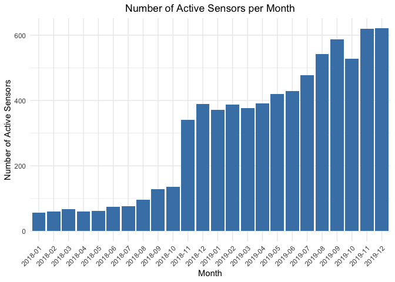
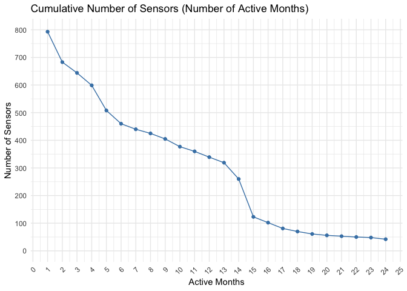
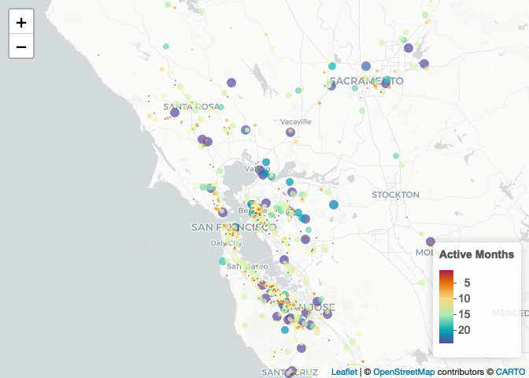
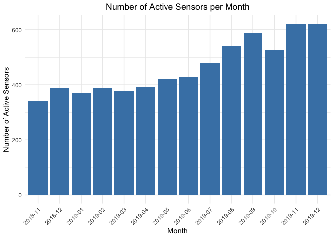
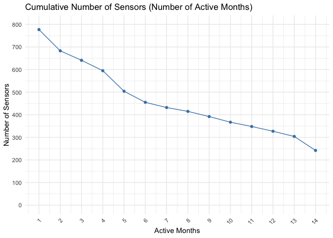
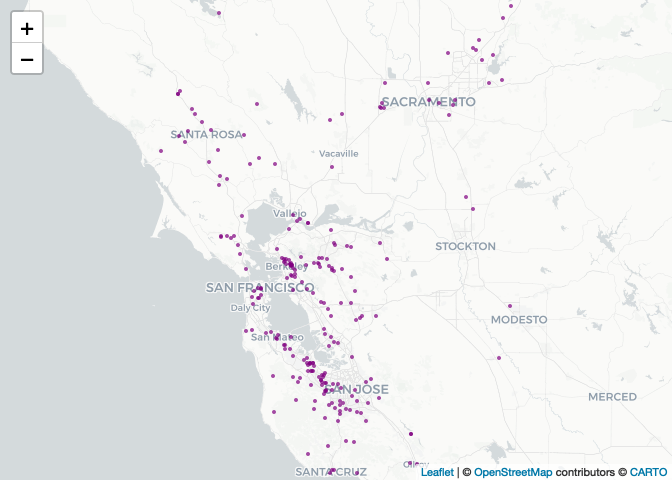

Preprocessing PurpleAir
================

# Clean PurpleAir data points

## Load required libraries

``` r
library(dplyr) # For data manipulation
library(data.table) # Faster than dataframes (for big files)
library(ggplot2) # Plots
library(lubridate) # Dates
library(sf) # Shapefiles
library(mapview) # Interactive maps
library(leaflet) # Interactive maps
```

## Read files

``` r
purpleair_data <- fread(paste0(purpleair_directory, "/purple_air_2018-2019.csv"))
purpleair_sensors <- st_read(paste0(purpleair_directory, "/purpleair_sensors.gpkg"), quiet = TRUE)
```

## Plot daily trend for a random day and sensor

``` r
# Pick a random day from the dataset
random_date <- sample(unique(date(purpleair_data$time_stamp)), 1)

# Pick a random sensor with complete data for that day
random_sensor <- purpleair_data %>%
  filter(date(time_stamp) == random_date) %>%
  group_by(sensor_index) %>%
  filter(n_distinct(hour(time_stamp)) == 24) %>%
  ungroup() %>% 
  select(sensor_index) %>% 
  distinct() %>% 
  sample_n(1)

# Get data for the random sensor and day
random_sensor_data <- purpleair_data %>% 
  filter(sensor_index == as.integer(random_sensor)) %>% 
  filter(date(time_stamp) == random_date)

# Plot the daily trend for the selected sensor
ggplot(random_sensor_data, aes(x = hour(time_stamp), y = pm2.5_atm)) +
  geom_line() +
  labs(
    x = "Hour of the Day", 
    y = "PM2.5 ATM", 
    title = paste0("PM2.5 for Sensor ", as.integer(random_sensor), " on ", random_date)
  ) +
  theme_minimal()
```

<!-- -->

## Plot of PM2.5 channel A vs B

``` r
ggplot(purpleair_data, aes(x = pm2.5_atm_a, y = pm2.5_atm_b)) +
  geom_point() +
  labs(x = "Channel A PM2.5",
       y = "Channel B PM2.5",
       title = "PM2.5 Channel A vs B",
       subtitle = "Axes limits set to 1000; more data points beyond the limit") +
  theme_minimal() +
  xlim(0, 1000) +
  ylim(0, 1000)
```

<!-- -->

# Check readings with inconsistencies between channel A and B

## plot of PM2.5channel A vs B

``` r
# Define thresholds (absolute difference and maximum pm2.5)
threshold <- 50
maxpm25 <- 2000

# Filter inconsistent data
inconsistent_readings <- purpleair_data %>% filter(abs(pm2.5_atm_a - pm2.5_atm_b) > threshold)

# Plot inconsistent readings
ggplot(inconsistent_readings, aes(x = pm2.5_atm_a, y = pm2.5_atm_b)) +
  geom_point() +
  labs(
    x = "Channel A PM2.5",
    y = "Channel B PM2.5",
    title = "Inconsistencies Between Channel A and B",
    subtitle = "Axes limits set to 1000; more data points beyond the limit"
  ) +
  theme_minimal() +
  xlim(0, 1000) +
  ylim(0, 1000)
```

<!-- -->

## Filter out inconsistencies

``` r
# Filter out rows where absolute difference is greater than threshold & PM2.5 < maximum
purpleair_filtered <- purpleair_data %>%
  filter(abs(pm2.5_atm_a - pm2.5_atm_b) <= threshold) %>%
  filter(pm2.5_atm_a < maxpm25) %>%
  filter(pm2.5_atm_b < maxpm25)

ggplot(purpleair_filtered, aes(x = pm2.5_atm_a, y = pm2.5_atm_b)) +
  geom_point() +
  labs(x = "Channel A PM2.5",
       y = "Channel B PM2.5",
       title = "PM2.5 Channel A vs B After Filtering") +
  theme_minimal()
```

<!-- -->

## Number of Active Sensors per Month

``` r
monthly_sensors <- purpleair_filtered %>%
  mutate(month = format(time_stamp, "%Y-%m")) %>%
  select(sensor_index, month) %>%
  distinct() %>%
  group_by(month) %>%
  summarize(count=n())

ggplot(monthly_sensors, aes(x = month, y = count)) +
  geom_bar(stat = "identity", fill = "steelblue") +
  labs(
    title = "Number of Active Sensors per Month",
    x = "Month",
    y = "Number of Active Sensors"
  ) +
  theme_minimal() +
  theme(
    axis.text.x = element_text(angle = 45, hjust = 1),
    plot.title = element_text(hjust = 0.5)
  )
```

<!-- -->

## Sensor Activity Distribution

``` r
# Summarize the number of active months per sensor
sensor_activity <- purpleair_filtered %>%
  mutate(month = format(time_stamp, "%Y-%m")) %>%
  select(sensor_index, month) %>%
  distinct() %>%
  group_by(sensor_index) %>%
  summarize(active_months = n(), .groups = 'drop')

# Create the cumulative distribution
sensor_activity_distribution <- sensor_activity %>%
  group_by(active_months) %>%
  summarize(count = n(), .groups = 'drop') %>%
  arrange(desc(active_months)) %>%
  mutate(
    cumulative_count = cumsum(count),
    cumulative_percentage = cumulative_count / sum(count) * 100
  )

  n_months <- max(sensor_activity_distribution$active_months)

  # Plot cumulative distribution
  ggplot(sensor_activity_distribution, aes(x = active_months, y = cumulative_count)) +
    geom_line(color = "steelblue") +
    geom_point(color = "steelblue") +
    labs(
      title = "Cumulative Number of Sensors (Number of Active Months)",
      x = "Active Months",
      y = "Number of Sensors"
    ) +
    theme_minimal() +
    scale_y_continuous(limits = c(0, 800), breaks = seq(0, 800, 100)) +
    scale_x_continuous(breaks = scales::pretty_breaks(n = n_months)) +
    theme(axis.text.x = element_text(angle = 45, hjust = 1))
```

<!-- -->

## Map Sensor Activity

``` r
# Join sensor activity data with sensor locations
sensor_activity <- purpleair_filtered %>%
  mutate(month = format(time_stamp, "%Y-%m")) %>%
  select(sensor_index, month) %>%
  distinct() %>%
  group_by(sensor_index) %>%
  summarize(active_months = n(), .groups = 'drop')

activity <- purpleair_sensors %>% inner_join(sensor_activity, by = "sensor_index")

# Define a color palette
color_palette <- colorNumeric(palette = hcl.colors(24, palette = "Spectral"), domain = activity$active_months)

# Create the leaflet map
leaflet(activity) %>%
  addProviderTiles("CartoDB") %>%
  addCircleMarkers(
    radius = ~active_months / 4,  # Circle size based on the number of active months
    color = ~color_palette(active_months),  # Circle color based on the number of active months
    fillOpacity = 0.7,
    stroke = FALSE,  # No border for the circles
    label = ~paste("Sensor Index:", sensor_index, "<br>Active Months:", active_months)
  ) %>%
  addLegend(
    "bottomright", 
    pal = color_palette, 
    values = ~active_months, 
    title = "Active Months", 
    opacity = 1
  )
```

<!-- -->

## Filter Data for Sensors Active 2018-11 to 2019-12

``` r
# Filter data from 2018-11 onwards
purpleair_filtered_subset <- purpleair_filtered %>% filter(format(time_stamp, "%Y-%m") >= "2018-11")
```

## Number of Active Sensors per Month

``` r
# Calculate active sensors per month
monthly_sensors <- purpleair_filtered_subset %>%
  mutate(month = format(time_stamp, "%Y-%m")) %>%
  select(sensor_index, month) %>%
  distinct() %>%
  group_by(month) %>%
  summarize(count = n())

# Plot active sensors per month
ggplot(monthly_sensors, aes(x = month, y = count)) +
  geom_bar(stat = "identity", fill = "steelblue") +
  labs(
    title = "Number of Active Sensors per Month",
    x = "Month",
    y = "Number of Active Sensors"
  ) +
  theme_minimal() +
  theme(
    axis.text.x = element_text(angle = 45, hjust = 1),
    plot.title = element_text(hjust = 0.5)
  )
```

<!-- -->

## Sensor Activity Distribution

``` r
# Summarize active months per sensor
sensor_activity <- purpleair_filtered_subset %>%
  mutate(month = format(time_stamp, "%Y-%m")) %>%
  select(sensor_index, month) %>%
  distinct() %>%
  group_by(sensor_index) %>%
  summarize(active_months = n(), .groups = 'drop')

# Create cumulative distribution
sensor_activity_distribution <- sensor_activity %>%
  group_by(active_months) %>%
  summarize(count = n(), .groups = 'drop') %>%
  arrange(desc(active_months)) %>%
  mutate(
    cumulative_count = cumsum(count),
    cumulative_percentage = cumulative_count / sum(count) * 100
  )

n_months <- max(sensor_activity_distribution$active_months)

# Plot cumulative distribution
ggplot(sensor_activity_distribution, aes(x = active_months, y = cumulative_count)) +
  geom_line(color = "steelblue") +
  geom_point(color = "steelblue") +
  labs(
    title = "Cumulative Number of Sensors (Number of Active Months)",
    x = "Active Months",
    y = "Number of Sensors"
  ) +
  theme_minimal() +
  scale_y_continuous(limits = c(0, 800), breaks = seq(0, 800, 100)) +
  scale_x_continuous(breaks = scales::pretty_breaks(n = n_months)) +
  theme(axis.text.x = element_text(angle = 45, hjust = 1))
```

<!-- -->

## Map Active Sensors

``` r
# Select sensors active every month in the time period
active_sensors <- sensor_activity %>% filter(active_months == 14) %>% select(sensor_index)

# Filter sensors based on activity
purpleair_sensors <- purpleair_sensors %>% filter(sensor_index %in% active_sensors$sensor_index)

# Map filtered sensors
leaflet(purpleair_sensors) %>%
  addProviderTiles("CartoDB") %>% 
  addCircleMarkers(radius = 2, color = "purple", fillOpacity = 0.7, stroke = FALSE)
```

<!-- -->

## Save Filtered Data

``` r
# Filter data for active sensors
purpleair_filtered_subset <- purpleair_filtered_subset %>% filter(sensor_index %in% active_sensors$sensor_index)

# Remove unnecessary columns
purpleair_filtered_subset <- purpleair_filtered_subset %>% select(-pm2.5_atm_a, -pm2.5_atm_b)

# Save filtered data
write.csv(purpleair_filtered_subset, file = file.path(preprocessing_directory, "purpleair_filtered_2018-2019.csv"), row.names = FALSE)
```

## Map Air Quality Index using average PM2.5

``` r
# https://www.epa.gov/sites/default/files/2016-04/documents/2012_aqi_factsheet.pdf
avg_pm25 <- purpleair_filtered %>%
  group_by(sensor_index) %>%
  summarize(avg_pm25 = mean(pm2.5_atm))

# Define the intervals and corresponding colors
intervals <- c(0, 12, 35.4, 55.4, 150.4, 250.4, Inf)
AQI <- c("Good", "Moderate", "Unhealthy for Sensitive Groups", "Unhealthy", "Very Unhealthy", "Hazardous")

# Create a new column with color intervals
avg_pm25$AQI <- cut(avg_pm25$avg_pm25, breaks = intervals, labels = AQI, include.lowest = TRUE)

pa_avgpm25 <- merge(purpleair_sensors, avg_pm25, by="sensor_index")

custom_colors <- c("green", "yellow", "orange", "red", "deeppink3", "darkred")

# Create a new column with color intervals
pa_avgpm25$AQI <- cut(pa_avgpm25$avg_pm25, breaks = intervals, labels = AQI, include.lowest = TRUE)

# Plot the average PM2.5 for each sensor with custom colors
mapview(pa_avgpm25, zcol = "AQI", col.regions = custom_colors, legend = TRUE, layer.name = "Average Air Quality Index")
```

<!-- -->
