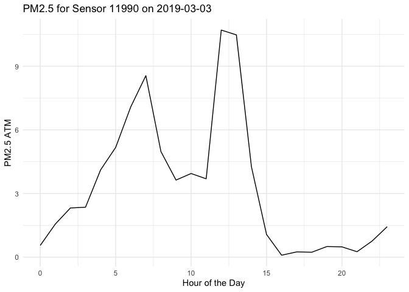
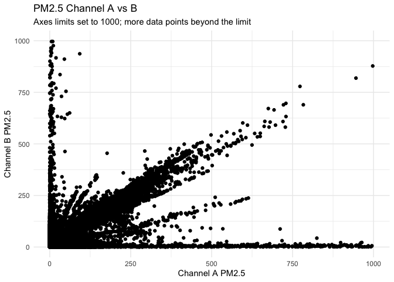
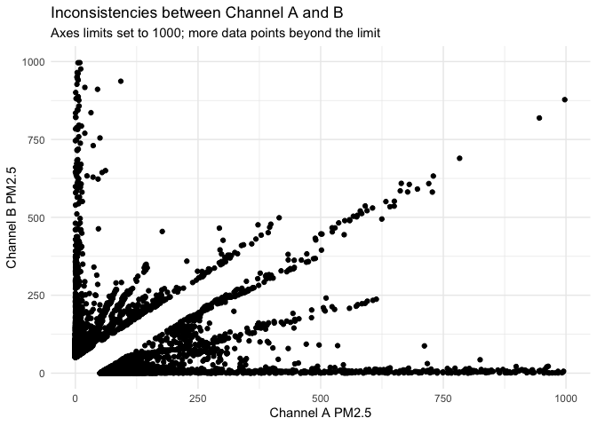
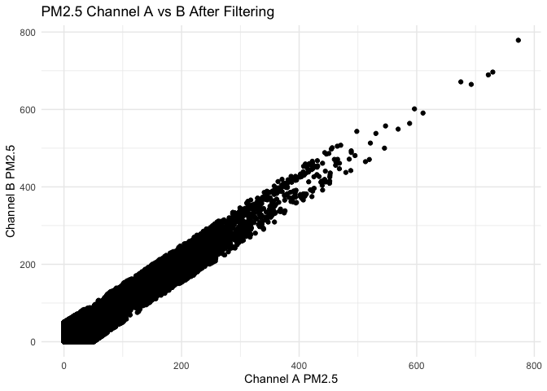
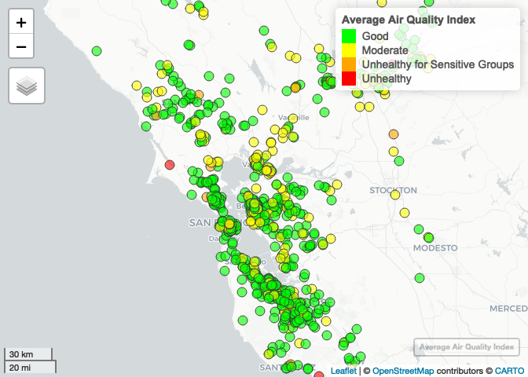

Preprocessing PurpleAir
================

# Clean PurpleAir data points

## Load required libraries

``` r
library(dplyr) # For data manipulation
library(data.table) # Faster than dataframes (for big files)
library(ggplot2) # Plots
library(lubridate) # Dates
library(sf) # Shapefiles
library(mapview) # Interactive maps
```

## Read files

``` r
purpleair_data <- fread(paste0(purpleair_directory,"/purple_air_sanfran_2018-2019.csv"))
purpleair_sensors <- st_read(paste0(purpleair_directory, "/purpleair_sensors.gpkg"), quiet = TRUE)
```

## Plot daily trend for a random day and sensor

``` r
# Pick a random day from our dataset
date_i <- sample(unique(date(purpleair_data$time_stamp)),1)

# Pick a random sensor with complete data for that day
sensor_i <- purpleair_data %>%
  filter(date(time_stamp)==date_i) %>%
  group_by(sensor_index) %>%
  filter(n_distinct(hour(time_stamp)) == 24) %>%
  ungroup() %>% 
  select(sensor_index) %>% 
  unique() %>% 
  sample_n(1)

# Get data for random sensor and day
sensor_i_data <- purpleair_data %>% 
  filter(sensor_index == as.integer(sensor_i)) %>% 
  filter(date(time_stamp) == date_i)

# Plot the daily trend for the selected sensor
ggplot(sensor_i_data, aes(x = hour(time_stamp), y = pm2.5_atm)) +
  geom_line() +
  labs(x = "Hour of the Day", y = "PM2.5 ATM", title = paste0("PM2.5 for Sensor ", as.integer(sensor_i)," on ", date_i)) +
  theme_minimal()
```

<!-- -->

## Plot of PM2.5 channel A vs B

``` r
ggplot(purpleair_data, aes(x = pm2.5_atm_a, y = pm2.5_atm_b)) +
  geom_point() +
  labs(x = "Channel A PM2.5",
       y = "Channel B PM2.5",
       title = "PM2.5 Channel A vs B",
       subtitle = "Axes limits set to 1000; more data points beyond the limit") +
  theme_minimal() +
  xlim(0, 1000) +
  ylim(0, 1000)
```

<!-- -->

# Check readings with inconsistencies between channel A and B

## plot of PM2.5channel A vs B

``` r
# absolute difference threshold
threshold <- 50

# maximum acceptable value of PM2.5
maxpm25 <- 2000

inconsistent_purpleair <- purpleair_data %>% filter(abs(pm2.5_atm_a - pm2.5_atm_b) > threshold)

ggplot(inconsistent_purpleair, aes(x = pm2.5_atm_a, y = pm2.5_atm_b)) +
  geom_point() +
  labs(x = "Channel A PM2.5",
       y = "Channel B PM2.5",
       title = "Inconsistencies between Channel A and B",
       subtitle = "Axes limits set to 1000; more data points beyond the limit") +
  theme_minimal() +
  xlim(0, 1000) +
  ylim(0, 1000)
```

<!-- -->

## Filter out inconsistencies and save file

``` r
# Filter out rows where absolute difference is greater than threshold & PM2.5 < maximum
purpleair_filtered <- purpleair_data %>%
  filter(abs(pm2.5_atm_a - pm2.5_atm_b) <= threshold) %>%
  filter(pm2.5_atm_a < maxpm25) %>%
  filter(pm2.5_atm_b < maxpm25)

write.csv(purpleair_filtered, file = paste0(preprocessing_directory,"purpleair_2018-2019.csv"), row.names = FALSE)

ggplot(purpleair_filtered, aes(x = pm2.5_atm_a, y = pm2.5_atm_b)) +
  geom_point() +
  labs(x = "Channel A PM2.5",
       y = "Channel B PM2.5",
       title = "PM2.5 Channel A vs B After Filtering") +
  theme_minimal()
```

<!-- -->

## Map Air Quality Index using average PM2.5

``` r
# https://www.epa.gov/sites/default/files/2016-04/documents/2012_aqi_factsheet.pdf
avg_pm25 <- purpleair_filtered %>%
  group_by(sensor_index) %>%
  summarize(avg_pm25 = mean(pm2.5_atm))

# Define the intervals and corresponding colors
intervals <- c(0, 12, 35.4, 55.4, 150.4, 250.4, Inf)
AQI <- c("Good", "Moderate", "Unhealthy for Sensitive Groups", "Unhealthy", "Very Unhealthy", "Hazardous")

# Create a new column with color intervals
avg_pm25$AQI <- cut(avg_pm25$avg_pm25, breaks = intervals, labels = AQI, include.lowest = TRUE)

pa_avgpm25 <- merge(purpleair_sensors, avg_pm25, by="sensor_index")

custom_colors <- c("green", "yellow", "orange", "red", "deeppink3", "darkred")

# Create a new column with color intervals
pa_avgpm25$AQI <- cut(pa_avgpm25$avg_pm25, breaks = intervals, labels = AQI, include.lowest = TRUE)

# Plot the average PM2.5 for each sensor with custom colors
mapview(pa_avgpm25, zcol = "AQI", col.regions = custom_colors, legend = TRUE, layer.name = "Average Air Quality Index")
```

<!-- -->
