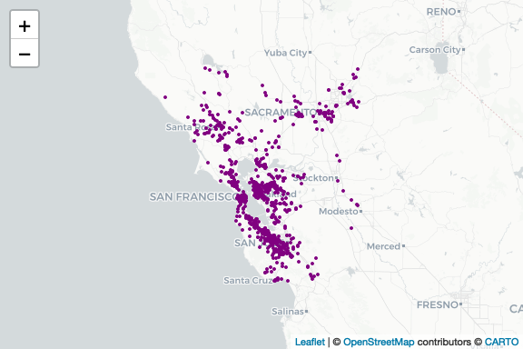

Download PurpleAir Data
================

Load required libraries

``` r
library(dplyr)         # Data manipulation
library(sf)            # Spatial data manipulation
library(ggplot2)       # Data visualization
library(lubridate)     # Working with dates
library(tigris)        # Counties map data
library(kableExtra)    # Printing formatted tables
library(purpleAirAPI)  # Download PurpleAir Data
library(DataOverviewR) # Data dictionary and summary
library(leaflet)       # Interactive maps
```

**Download Sensor Data**  
Fields: sensor_index, date_created, last_seen, latitude, longitude  

PurpleAir Documentation:  
[Sensor
fields](https://api.purpleair.com/#api-sensors-get-sensor-data)  
[Field
Descriptions](https://community.purpleair.com/t/api-history-fields-descriptions/4652)

``` r
# Download sensor data
api_key = readr::read_file(file.path("inputs", "purpleair_key.txt"))
pa <- getPurpleairSensors(
  apiReadKey = api_key, 
  fields = c("latitude", "longitude", "date_created", "last_seen", 
             "location_type")) %>% 
  na.omit()
```

Filter sensors to bay area

``` r
# Convert the PurpleAir data frame to an sf object
pa_sf <- st_as_sf(pa, coords=c("longitude", "latitude"), crs = crs)

# Define bounding box for the Bay Area
bbox <- c(xmin = -123.8, ymin = 36.9, xmax = -121.0, ymax = 39.0)
bbox_sf <- st_as_sfc(st_bbox(bbox))
st_crs(bbox_sf) <- crs

# Filter sensors within bounding box
purpleairs_sf <- st_intersection(pa_sf, bbox_sf)
```

------------------------------------------------------------------------

**Data Dictionary**

#### PurpleAir Sensors in Bay Area

`26,961` rows

`0` rows with missing values

|    Column     |   Type    |                                   Description                                   |
|:-------------:|:---------:|:-------------------------------------------------------------------------------:|
| sensor_index  |  numeric  | The sensor’s index. Can be used to add a sensor to a group or view its details. |
| date_created  |   Date    |              The UNIX time stamp from when the device was created.              |
|   last_seen   |   Date    | The UNIX time stamp of the last time the server received data from the device.  |
| location_type |  numeric  |       The location type. Possible values are: 0 = Outside or 1 = Inside.        |
|   geometry    | sfc_POINT |                                    Geometry                                     |

**View data**

| sensor_index | date_created | last_seen  | location_type | geometry                   |
|-------------:|:-------------|:-----------|--------------:|:---------------------------|
|           53 | 2016-02-04   | 2024-09-28 |             0 | POINT (-111.7048 40.24674) |
|           77 | 2016-03-02   | 2024-09-28 |             0 | POINT (-111.8253 40.75082) |
|          182 | 2016-08-01   | 2024-09-28 |             0 | POINT (-123.7423 49.16008) |

------------------------------------------------------------------------

Set inputs for PurpleAir data

``` r
# https://community.purpleair.com/t/what-is-the-difference-between-cf-1-atm-and-alt/6442
fields <- c("pm2.5_alt", "pm2.5_alt_a", "pm2.5_alt_b",
            "pm2.5_atm", "pm2.5_atm_a", "pm2.5_atm_b", 
            "pm2.5_cf_1", "pm2.5_cf_1_a", "pm2.5_cf_1_b",
            "rssi", "uptime", "memory", "humidity", "temperature",
            "pressure", "analog_input")
average <- "60"

# Date range for data download (2018-2019)
start_date <- as.Date("2018-01-01")
end_date <- as.Date("2019-12-31")
```

Download Purple Air Hourly Data for 2018-2019

``` r
# only download if file doesnt exist
filename <- paste0("purpleair_", start_date, "_", end_date, ".csv")
filepath <- file.path("data", "raw", filename)

if (!file.exists(filepath)) {
  filtered_sensors_sf <- purpleairs_sf %>% 
    filter(last_seen >= start_date) %>% 
    filter(date_created <= end_date) %>% 
    select(sensor_index, location_type) %>%
    st_drop_geometry()
  
  sensor_ids <- unique(filtered_sensors_sf$sensor_index)
  
  # Get PurpleAir data
  purpleair_data <- getSensorHistory(
    sensorIndex = sensor_ids,
    apiReadKey = api_key,
    startDate = start_date,
    endDate = end_date,
    average = average,
    fields = fields
  )
  
  purpleair_data <- left_join(purpleair_data, filtered_sensors_sf, by = "sensor_index")
  
  # Save to CSV file
  write.csv(purpleair_data, file = filepath, row.names = FALSE)
}
```

``` r
# Save sensors and locations
filepath <- file.path("data", "raw", "pa_sensors.csv")
if (!file.exists(filepath)) {
  filtered_sensors <- pa %>% filter(sensor_index %in% unique(purpleair_data$sensor_index))
  write.csv(filtered_sensors, file = filepath, row.names = FALSE)
}
```

------------------------------------------------------------------------

**Data Dictionary**

#### PurpleAir Bay Area Hourly 2018-2019

`5,136,009` rows

`1,233,265` rows with missing values

|    Column     |   Type    |                                                                               Description                                                                               |
|:-------------:|:---------:|:-----------------------------------------------------------------------------------------------------------------------------------------------------------------------:|
|  time_stamp   | character |                                                               UTC (Unix) time stamp for that row of data.                                                               |
|     rssi      |  integer  |                                                                        The WiFi signal strength.                                                                        |
|    uptime     |  numeric  |                                             The time in minutes since the firmware started as last reported by the sensor.                                              |
|    memory     |  integer  |                                                                         Free HEAP memory in Kb.                                                                         |
|   humidity    |  numeric  | Relative humidity inside of the sensor housing (%). This matches the ‘Raw Humidity’ map layer and on average is 4% lower than ambient conditions. Null if not equipped. |
|  temperature  |  numeric  | Temperature inside of the sensor housing (F). This matches the ‘Raw Temperature’ map layer and on average is 8°F higher than ambient conditions. Null if not equipped.  |
|   pressure    |  numeric  |                                                                     Current pressure in Millibars.                                                                      |
| analog_input  |  numeric  |                                 If anything is connected to it, the analog voltage on ADC input of the PurpleAir sensor control board.                                  |
|   pm2.5_alt   |  numeric  |             Estimated mass concentration PM2.5 (µg/m³). PM2.5 are fine particulates with a diameter of fewer than 2.5 microns. ALT Formula for estimation.              |
|  pm2.5_alt_a  |  numeric  |                                                                          Channel A ALT variant                                                                          |
|  pm2.5_alt_b  |  numeric  |                                                                          Channel B ALT variant                                                                          |
| sensor_index  |  integer  |                                             The sensor’s index. Can be used to add a sensor to a group or view its details.                                             |
| location_type |  integer  |                                                   The location type. Possible values are: 0 = Outside or 1 = Inside.                                                    |

#### Missing Values

`5,136,009` rows

`1,233,265` rows with missing values

|    Column     | NA_Count | NA_Percentage |
|:-------------:|:--------:|:-------------:|
|  time_stamp   |    0     |               |
|     rssi      |  4,925   |      0%       |
|    uptime     |  4,925   |      0%       |
|    memory     |  2,233   |      0%       |
|   humidity    |  83,285  |      2%       |
|  temperature  |  83,285  |      2%       |
|   pressure    | 387,284  |      8%       |
| analog_input  |  2,444   |      0%       |
|   pm2.5_alt   |   814    |      0%       |
|  pm2.5_alt_a  |  2,206   |      0%       |
|  pm2.5_alt_b  | 868,311  |      17%      |
| sensor_index  |    0     |               |
| location_type |    0     |               |

**View data**

| time_stamp          | rssi | uptime | memory | humidity | temperature | pressure | analog_input | pm2.5_alt | pm2.5_alt_a | pm2.5_alt_b | sensor_index | location_type |
|:--------------------|-----:|-------:|-------:|---------:|------------:|---------:|-------------:|----------:|------------:|------------:|-------------:|--------------:|
| 2018-01-01 00:00:00 |  -56 |  59100 |  28159 |   35.676 |      71.729 |       NA |        0.010 |      36.7 |        36.4 |        37.0 |          767 |             0 |
| 2018-01-01 01:00:00 |  -57 |  62700 |  28159 |   38.911 |      68.619 |       NA |        0.016 |      32.1 |        31.7 |        32.4 |          767 |             0 |
| 2018-01-01 02:00:00 |  -57 |  66300 |  28164 |   41.358 |      66.688 |       NA |        0.019 |      28.2 |        27.6 |        28.8 |          767 |             0 |

------------------------------------------------------------------------

Map PurpleAir Sensors Bay Area (2018-2019)

``` r
# Create a leaflet map showing the sensors
leaflet() %>%
  addCircleMarkers(data = pa_sf, popup = ~sensor_index,
                   fillColor = "purple", fillOpacity = 1,
                   color = "purple", weight = 2, opacity = 1, radius = 1) %>%
  addProviderTiles("CartoDB")
```

<!-- -->
