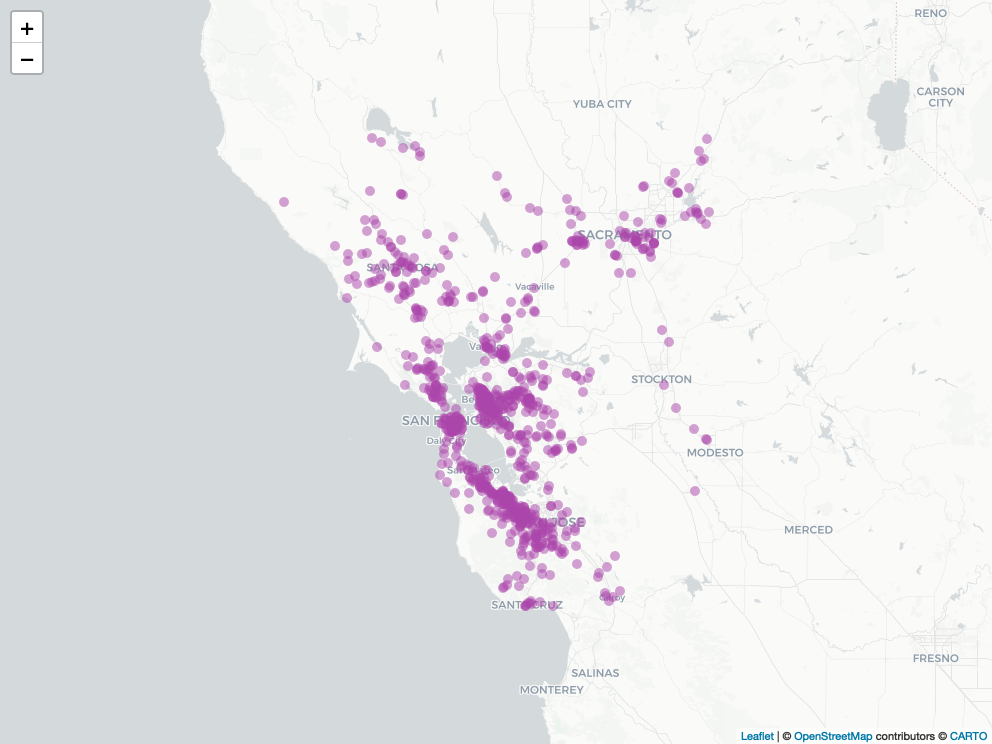

# PurpleAir Data

# Purpose

This document downloads PurpleAir sensor data for the Bay Area
(2018-2019) and provides comprehensive documentation of the data
structure.

```r
library(dplyr)         # Data manipulation
library(sf)            # Spatial data manipulation
library(ggplot2)       # Data visualization
library(kableExtra)    # Formatted tables
library(PurpleAirAPI)  # PurpleAir Data API
library(leaflet)       # Interactive maps
library(htmlwidgets)   # HTML widgets
library(webshot)       # Image conversion
library(DataOverviewR) # Data documentation
```

# 1. Data Download

## 1.1 Download Sensor Metadata

```r
# API configuration
api_key = readr::read_file(file.path("inputs", "purpleair_key.txt"))

# Download sensor metadata
pa_sensors <- getPurpleairSensors(
  apiReadKey = api_key,
  fields = c("latitude", "longitude", "date_created", "last_seen", "location_type")
) %>%
  na.omit()

# Define Bay Area bounding box
bbox <- c(xmin = -123.8, ymin = 36.9, xmax = -121.0, ymax = 39.0)
bbox_sf <- st_as_sfc(st_bbox(bbox))
st_crs(bbox_sf) <- 4326

# Filter to Bay Area sensors
pa_sf <- st_as_sf(pa_sensors, coords=c("longitude", "latitude"), crs = 4326)
purpleairs_sf <- st_intersection(pa_sf, bbox_sf)
```

    ## Warning: attribute variables are assumed to be spatially constant throughout
    ## all geometries

## 1.2 Download Hourly Measurements

```r
# Configure measurement parameters
fields <- c(
  # PM2.5 measurements
  "pm2.5_alt", "pm2.5_alt_a", "pm2.5_alt_b",
  "pm2.5_atm", "pm2.5_atm_a", "pm2.5_atm_b",
  "pm2.5_cf_1", "pm2.5_cf_1_a", "pm2.5_cf_1_b",
  # Environmental measurements
  "humidity", "temperature", "pressure",
  # Device status
  "rssi", "uptime", "memory", "analog_input"
)

# Time configuration
start_date <- as.Date("2018-01-01")
end_date <- as.Date("2019-12-31")
average <- "60" # 60-minute averages

# Download data if not already exists
filename <- paste0("purpleair_", start_date, "_", end_date, ".csv")
filepath <- file.path("data", "raw", filename)

if (!file.exists(filepath)) {
  # Filter sensors active during time period
  filtered_sensors_sf <- purpleairs_sf %>%
    filter(last_seen >= start_date, date_created <= end_date) %>%
    select(sensor_index, location_type) %>%
    st_drop_geometry()

  # Download hourly data
  purpleair_data <- getSensorHistory(
    sensorIndex = unique(filtered_sensors_sf$sensor_index),
    apiReadKey = api_key,
    startDate = start_date,
    endDate = end_date,
    average = average,
    fields = fields
  )

  # Add location type
  purpleair_data <- left_join(purpleair_data, filtered_sensors_sf, by = "sensor_index")

  # Save raw data
  write.csv(purpleair_data, file = filepath, row.names = FALSE)
} else {
  # Read purple air data
  purpleair_data <- read.csv(filepath)
}

# Save sensor metadata
filepath <- file.path("data", "raw", "pa_sensors.csv")
if (!file.exists(filepath)) {
  filtered_sensors <- pa_sensors %>%
    filter(sensor_index %in% unique(purpleair_data$sensor_index))
  write.csv(filtered_sensors, file = filepath, row.names = FALSE)
}
```

# 2. Data Documentation

## 2.1 Sensor Metadata Dictionary

```r
desc <- data_description(pa_sf,
                         var_desc = c(
                           "sensor_index" = "Unique identifier for each sensor",
                           "date_created" = "UTC timestamp of sensor creation",
                           "last_seen" = "UTC timestamp of last data received",
                           "location_type" = "Sensor location (0=Outside, 1=Inside)",
                           "geometry" = "Spatial coordinates"
                         ))

data_dictionary(pa_sf,
                data_title = "PurpleAir Sensors in Bay Area",
                descriptions = desc,
                hide = c("top_n", "NA_Percentage", "NA_Count", "n_unique"))
```

#### PurpleAir Sensors in Bay Area

`26,672` rows

`0` rows with missing values

|    Column     |   Type    |              Description              |
| :-----------: | :-------: | :-----------------------------------: |
| sensor_index  |  numeric  |   Unique identifier for each sensor   |
| date_created  |   Date    |   UTC timestamp of sensor creation    |
|   last_seen   |   Date    |  UTC timestamp of last data received  |
| location_type |  numeric  | Sensor location (0=Outside, 1=Inside) |
|   geometry    | sfc_POINT |          Spatial coordinates          |

```r
# Show example records
knitr::kable(head(pa_sf, 3),
             row.names = FALSE,
             format = "markdown",
             caption = "Example Sensor Records")
```

| sensor_index | date_created | last_seen  | location_type | geometry                   |
| -----------: | :----------- | :--------- | ------------: | :------------------------- |
|          182 | 2016-08-01   | 2024-11-15 |             0 | POINT (-123.7423 49.16008) |
|          195 | 2016-08-01   | 2024-11-15 |             0 | POINT (-124.1288 41.06)    |
|          286 | 2016-09-06   | 2024-11-15 |             0 | POINT (-124.2666 49.48426) |

Example Sensor Records

## 2.2 Measurement Data Dictionary

```r
desc <- data_description(
  purpleair_data,
  var_desc =
    c("time_stamp" = "UTC (Unix) time stamp for that row of data.",
      "rssi" = "The WiFi signal strength.",
      "uptime" = "The time in minutes since the firmware started as last reported by the sensor.",
      "memory" = "Free HEAP memory in Kb.",
      "humidity" = "Relative humidity inside of the sensor housing (%). This matches the 'Raw Humidity' map layer and on average is 4% lower than ambient conditions. Null if not equipped.",
      "temperature" = "Temperature inside of the sensor housing (F). This matches the 'Raw Temperature' map layer and on average is 8°F higher than ambient conditions. Null if not equipped.",
      "pressure" = "Current pressure in Millibars.",
      "analog_input" = "If anything is connected to it, the analog voltage on ADC input of the PurpleAir sensor control board.",
      "pm2.5_alt" = "Estimated mass concentration PM2.5 (µg/m³). PM2.5 are fine particulates with a diameter of fewer than 2.5 microns. ALT Formula for estimation.",
      "pm2.5_alt_a" = "Channel A ALT variant",
      "pm2.5_alt_b" = "Channel B ALT variant",
      "sensor_index" = "The sensor's index. Can be used to add a sensor to a group or view its details.",
      "location_type" = "The location type. Possible values are: 0 = Outside or 1 = Inside."
    ))

data_dictionary(purpleair_data,
                data_title = "PurpleAir Bay Area Hourly Measurements",
                descriptions = desc,
                hide = c("NA_Count", "NA_Percentage", "N_Unique", "top_n"))
```

#### PurpleAir Bay Area Hourly Measurements

`5,136,009` rows

`1,233,265` rows with missing values

|    Column     |   Type    |                                                                               Description                                                                               |
| :-----------: | :-------: | :---------------------------------------------------------------------------------------------------------------------------------------------------------------------: |
|  time_stamp   | character |                                                               UTC (Unix) time stamp for that row of data.                                                               |
|     rssi      |  integer  |                                                                        The WiFi signal strength.                                                                        |
|    uptime     |  integer  |                                             The time in minutes since the firmware started as last reported by the sensor.                                              |
|    memory     |  integer  |                                                                         Free HEAP memory in Kb.                                                                         |
|   humidity    |  numeric  | Relative humidity inside of the sensor housing (%). This matches the ‘Raw Humidity’ map layer and on average is 4% lower than ambient conditions. Null if not equipped. |
|  temperature  |  numeric  | Temperature inside of the sensor housing (F). This matches the ‘Raw Temperature’ map layer and on average is 8°F higher than ambient conditions. Null if not equipped.  |
|   pressure    |  numeric  |                                                                     Current pressure in Millibars.                                                                      |
| analog_input  |  numeric  |                                 If anything is connected to it, the analog voltage on ADC input of the PurpleAir sensor control board.                                  |
|   pm2.5_alt   |  numeric  |             Estimated mass concentration PM2.5 (µg/m³). PM2.5 are fine particulates with a diameter of fewer than 2.5 microns. ALT Formula for estimation.              |
|  pm2.5_alt_a  |  numeric  |                                                                          Channel A ALT variant                                                                          |
|  pm2.5_alt_b  |  numeric  |                                                                          Channel B ALT variant                                                                          |
| sensor_index  |  integer  |                                             The sensor’s index. Can be used to add a sensor to a group or view its details.                                             |
| location_type |  integer  |                                                   The location type. Possible values are: 0 = Outside or 1 = Inside.                                                    |

```r
# Show missing value patterns
data_dictionary(purpleair_data,
                data_title = "Missing Values Summary",
                hide = c("top_n", "Type", "N_Unique"))
```

#### Missing Values Summary

`5,136,009` rows

`1,233,265` rows with missing values

|    Column     | NA_Count | NA_Percentage |
| :-----------: | :------: | :-----------: |
|  time_stamp   |    0     |               |
|     rssi      |  4,925   |      0%       |
|    uptime     |  4,925   |      0%       |
|    memory     |  2,233   |      0%       |
|   humidity    |  83,285  |      2%       |
|  temperature  |  83,285  |      2%       |
|   pressure    | 387,284  |      8%       |
| analog_input  |  2,444   |      0%       |
|   pm2.5_alt   |   814    |      0%       |
|  pm2.5_alt_a  |  2,206   |      0%       |
|  pm2.5_alt_b  | 868,311  |      17%      |
| sensor_index  |    0     |               |
| location_type |    0     |               |

```r
# Show example records
knitr::kable(head(purpleair_data, 3),
             row.names = FALSE,
             format = "markdown",
             caption = "Example Measurements")
```

| time_stamp          | rssi | uptime | memory | humidity | temperature | pressure | analog_input | pm2.5_alt | pm2.5_alt_a | pm2.5_alt_b | sensor_index | location_type |
| :------------------ | ---: | -----: | -----: | -------: | ----------: | -------: | -----------: | --------: | ----------: | ----------: | -----------: | ------------: |
| 2018-01-01          |  -56 |  59100 |  28159 |   35.676 |      71.729 |       NA |        0.010 |      36.7 |        36.4 |        37.0 |          767 |             0 |
| 2018-01-01 01:00:00 |  -57 |  62700 |  28159 |   38.911 |      68.619 |       NA |        0.016 |      32.1 |        31.7 |        32.4 |          767 |             0 |
| 2018-01-01 02:00:00 |  -57 |  66300 |  28164 |   41.358 |      66.688 |       NA |        0.019 |      28.2 |        27.6 |        28.8 |          767 |             0 |

Example Measurements

# 3. Spatial Coverage Visualization

```r
img_path <- file.path("../docs", "plots", "pa-sensors-map.png")

if (!file.exists(img_path)) {
  map_path <- file.path("../docs", "maps", "pa-sensors-map.html")
  m <- leaflet() %>%
    addCircleMarkers(data = pa_sf,
                     popup = ~as.character(sensor_index),
                     label = ~as.character(sensor_index),
                     fillColor = "#AA44AA",
                     fillOpacity = 0.5,
                     weight = 0,
                     radius = 5) %>%
    addProviderTiles("CartoDB")
  saveWidget(m, file = map_path)
  webshot(map_path, file = img_path)
}

knitr::include_graphics(img_path)
```



# 4. Initial Data Quality Check

```r
# Basic data quality metrics
quality_metrics <- data.frame(
  Metric = c(
    "Total Sensors",
    "Date Range",
    "Total Measurements",
    "Measurements per Sensor",
    "Missing PM2.5 Rate",
    "Indoor Sensors"
  ),
  Value = c(
    format(n_distinct(purpleair_data$sensor_index), big.mark = ","),
    paste(format(range(as.Date(purpleair_data$time_stamp)), "%Y-%m-%d"), collapse = " to "),
    format(nrow(purpleair_data), big.mark = ","),
    format(round(nrow(purpleair_data)/n_distinct(purpleair_data$sensor_index), 2), big.mark = ","),
    format(round(mean(is.na(purpleair_data$pm2.5_alt)), 5), nsmall = 5),
    format(round(sum(purpleair_data$location_type == 1, na.rm=TRUE)/nrow(purpleair_data), 3), nsmall = 3)
  )
)

knitr::kable(quality_metrics, align = "l", caption = "Data Quality Metrics")
```

| Metric                  | Value                    |
| :---------------------- | :----------------------- |
| Total Sensors           | 933                      |
| Date Range              | 2018-01-01 to 2019-12-31 |
| Total Measurements      | 5,136,009                |
| Measurements per Sensor | 5,504.83                 |
| Missing PM2.5 Rate      | 0.00016                  |
| Indoor Sensors          | 0.265                    |

Data Quality Metrics
