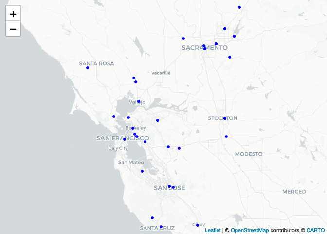

Download EPA Air Quality Data
================

Load required libraries

``` r
library(dplyr)         # Data manipulation
library(sf)            # Spatial data manipulation
library(RAQSAPI)       # EPA Air Quality API
library(leaflet)       # Interactive maps
library(ggplot2)       # Data visualization
library(lubridate)     # Working with dates
library(tidyr)         # Tidy messy data
library(DataOverviewR) # Data dictionary and summary
```

Define Bay Area bounding box

``` r
# Define the Bay Area bounding box coordinates
bbox <- c(xmin = -123.8, ymin = 36.9, xmax = -121.0, ymax = 39.0)

# Convert the bounding box to an sf object and set the CRS (WGS 84)
bbox_sf <- st_as_sfc(st_bbox(bbox))
st_crs(bbox_sf) <- 4326

# Create a buffered area around the bounding box (25 km buffer)
new_bbox_sf <- st_buffer(bbox_sf, 25000)

# Extract min and max latitudes and longitudes for the buffered area
minlon <- bbox["xmin"]
maxlon <- bbox["xmax"]
minlat <- bbox["ymin"]
maxlat <- bbox["ymax"]
```

**Download AQS Monitors in Bay Area**

United States Environmental Protection Agency: Air Quality System (AQS)

``` r
# Get PM2.5 monitors in the Bay Area for the specified date range
monitor_info <- aqs_monitors_by_box(
  parameter = "88101",
  bdate = as.Date("20180101", "%Y%m%d"),
  edate = as.Date("20191231", "%Y%m%d"),
  minlat = minlat, maxlat = maxlat,
  minlon = minlon, maxlon = maxlon
)

# Convert monitor data to an sf object for mapping
monitors_sf <- monitor_info %>%
  select(si_id, latitude, longitude) %>%
  st_as_sf(coords = c("longitude", "latitude"), crs = 4326)
```

Map of AQS Monitors in Bay Area

``` r
# Create a leaflet map showing the monitors
leaflet() %>%
  addCircleMarkers(data = monitors_sf, popup = ~si_id,
                   fillColor = "blue", fillOpacity = 1,
                   color = "blue", weight = 2, opacity = 1, radius = 2) %>%
  addProviderTiles("CartoDB")
```

<!-- -->

**Download AQS Hourly Data in Bay Area**

``` r
filepath <- file.path("data", "raw", "EPA_airquality.csv") 
if (!file.exists(filepath)) { # (skip if full file exists)
  # Loop through each monitor and download, process, and save data to CSV
  for (i in 1:nrow(monitor_info)) {
    id <- paste0(monitor_info$state_code[i], "_", 
                 monitor_info$county_code[i], "_", 
                 monitor_info$site_number[i])
    filename <- paste0("aqs_2019_", id, ".csv")
    filepath <- file.path("data", "raw", "AQS", filename)
    if (!file.exists(filepath)) {
      monitor_data <- aqs_sampledata_by_site(
        parameter = "88101",
        bdate = as.Date("20190101", "%Y%m%d"),
        edate = as.Date("20191231", "%Y%m%d"),
        stateFIPS = monitor_info$state_code[i],
        countycode = monitor_info$county_code[i],
        sitenum = monitor_info$site_number[i],
        duration = "1"
      )
      
      # Stop if monitor_data is empty
      if (nrow(monitor_data) == 0) {
        next
      }
      
      # Process data by creating a timestamp and selecting relevant columns
      processed_data <- monitor_data %>%
        mutate(timestamp = paste(date_local, time_local),
               pm25 = sample_measurement,
               id = paste0(state_code,"_",county_code,"_",site_number)) %>%
        select(timestamp, id, state_code, county_code, site_number, poc, pm25, latitude, longitude)
      
      write.csv(processed_data, file = filepath, row.names = FALSE)
    }
  }
}
```

Combine AQS Files

``` r
filepath <- file.path("data", "raw", "EPA_airquality.csv")
if (!file.exists(filepath)) {
  # Get the list of AQS files
  csv_files <- list.files(path = file.path("data", "raw", "AQS"), 
                          pattern = "aqs_201[89]_.*\\.csv", 
                          full.names = TRUE)
  
  # Read and combine all CSV files into a single data frame
  combined_data <- csv_files %>%
    lapply(read.csv) %>%
    bind_rows()
  
  # Save the combined data to a single CSV file
  write.csv(combined_data, 
            file = filepath, 
            row.names = FALSE)
}
```

------------------------------------------------------------------------

**Data Dictionary**

#### Air Quality System (AQS)

`461,708` rows

`15,512` rows with missing values

|   Column    |   Type    |                                                             Description                                                             |
|:-----------:|:---------:|:-----------------------------------------------------------------------------------------------------------------------------------:|
|  timestamp  | character |                     The date and time, in local standard time, to which the NAAQS average calculation applies.                      |
|     id      | character |                                                           AQS Monitor ID                                                            |
| state_code  |  integer  |                                      The FIPS code of the state in which the monitor resides.                                       |
| county_code |  integer  |                                           The FIPS County Code where the monitor resides.                                           |
| site_number |  integer  |                       An identifier for the site in the onwning agency’s (e.g., not US EPA) numbering scheme.                       |
|     poc     |  integer  | This is the ‘Parameter Occurrence Code’ used to distinguish different instruments that measure the same parameter at the same site. |
|    pm25     |  numeric  |                                                      PM2.5 - Local Conditions                                                       |
|  latitude   |  numeric  |                 The angular distance north or south of the equator measured in decimal degrees. North is positive.                  |
|  longitude  |  numeric  |      The angular distance east or west of the prime meridian measured in decimal degrees. East is positive, West is negative.       |

#### Missing Values

`461,708` rows

`15,512` rows with missing values

|   Column    | NA_Count | NA_Percentage |
|:-----------:|:--------:|:-------------:|
|  timestamp  |    0     |               |
|     id      |    0     |               |
| state_code  |    0     |               |
| county_code |    0     |               |
| site_number |    0     |               |
|     poc     |    0     |               |
|    pm25     |  15,512  |      3%       |
|  latitude   |    0     |               |
|  longitude  |    0     |               |

**View data**

| timestamp        | id          | state_code | county_code | site_number | poc | pm25 | latitude | longitude |
|:-----------------|:------------|-----------:|------------:|------------:|----:|-----:|---------:|----------:|
| 2018-01-01 00:00 | 06_001_0007 |          6 |           1 |           7 |   3 |   62 | 37.68753 | -121.7842 |
| 2018-01-01 01:00 | 06_001_0007 |          6 |           1 |           7 |   3 |   57 | 37.68753 | -121.7842 |
| 2018-01-01 02:00 | 06_001_0007 |          6 |           1 |           7 |   3 |   62 | 37.68753 | -121.7842 |

------------------------------------------------------------------------
