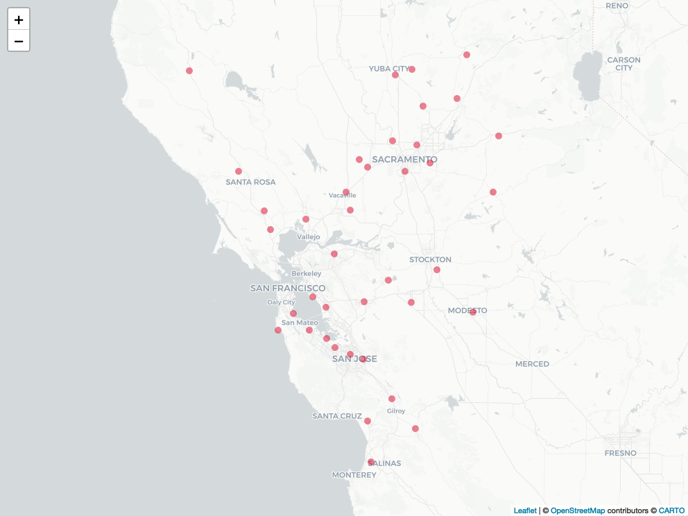

Download Weather Data
================

Load required libraries

``` r
library(riem)          # Download weather station data
library(dplyr)         # Data manipulation
library(sf)            # Spatial data manipulation
library(leaflet)       # Interactive maps
library(htmlwidgets)   # Creating HTML widgets
library(webshot)       # Convert URL to image
library(DataOverviewR) # Data dictionary and summary
```

Define Bay Area bounding box

``` r
# Greater san fran area
bbox <- c(xmin = -123.8, ymin = 36.9, xmax = -121.0, ymax = 39.0)

# Convert the bounding box to an sf object and set the CRS (WGS 84)
bbox_sf <- st_as_sfc(st_bbox(bbox))
st_crs(bbox_sf) <- 4326

# Create a buffered area around the bounding box (25 km buffer)
new_bbox_sf <- st_buffer(bbox_sf, 25000)
```

Get airport weather stations in the Bay Area

``` r
# Networks where name contains "california"
cali_networks <- riem_networks() %>% filter(grepl("California", name, ignore.case = TRUE))
stations <- riem_stations(network = cali_networks$code) %>% select(id,name,elevation,county,lon,lat)

# convert stations to sf object
stations_sf <- st_as_sf(stations, coords = c("lon", "lat"), crs = 4326)

# get intersection of buffer with stations
stations_within_bbox <- st_intersection(stations_sf, new_bbox_sf)

filepath <- file.path("data", "raw", "weather_stations.gpkg") 

st_write(stations_within_bbox, filepath, driver = "GPKG", append=FALSE)
```

Map of Airport Weather Stations in Bay Area

``` r
img_path <- file.path("../docs", "plots", "weather-stations-map.png")
if (!file.exists(img_path)) {
  map_path <- file.path("../docs", "maps", "weather-stations-map.html")
  m <- leaflet() %>%
  addCircleMarkers(data = stations_within_bbox, popup = ~as.character(id), label = ~as.character(id),
                   fillColor = "#d90429", fillOpacity = 0.5, weight = 0, radius = 5) %>%
  addProviderTiles("CartoDB")
  saveWidget(m, file = map_path)
  webshot(map_path, file = img_path)
}
knitr::include_graphics(img_path)
```



Download Weather Station Hourly Data for 2018-2019

``` r
filepath <- file.path("data", "raw", "weather.csv")

if (!file.exists(filepath)) {
  # Initialize empty dataframe to store weather measures for all stations
  measures_df <- data.frame()
  
  # Loop through each weather station within the specified bounding box
  for (id in stations_within_bbox$id) {
    # Get measures for the current station
    measures <- riem_measures(station = id, date_start = "2018-01-01", date_end = "2019-12-31")
    
    if (is.null(measures)) next
    
    # select relevant columns
    measures_subset = measures %>% 
      select(station, valid, tmpf, relh, drct, sknt, gust, lon, lat) %>%
      filter(if_any(c(tmpf, relh, drct, sknt, gust), ~ !is.na(.)))
    
    # Aggregate weather data to hourly intervals and calculate mean for each variable
    measures_subset$timestamp <- format(measures_subset$valid, "%Y-%m-%d %H:00:00")
    
    # Create summary dataframe with hourly averages of weather variables for each station
    summary_df <- measures_subset %>%
      group_by(station, timestamp) %>%
      summarize(
        temp_fahrenheit = mean(tmpf, na.rm = TRUE),
        rel_humidity = mean(relh, na.rm = TRUE),
        wind_direction = mean(drct, na.rm = TRUE),
        wind_speed = mean(sknt, na.rm = TRUE),
        wind_gust = mean(gust, na.rm = TRUE),
        lon = first(lon),
        lat = first(lat),
        .groups = 'drop')
    
    # Add to measures_df
    measures_df <- rbind(measures_df, summary_df)
  }
  
  # Save to CSV file
  write.csv(measures_df, file = filepath, row.names = FALSE)
}
```

------------------------------------------------------------------------

**Data Dictionary**

#### Airport Weather Stations Bay Area Hourly 2018-2019

`588,075` rows

`513,500` rows with missing values

|     Column      |   Type    |                     Description                     |
|:---------------:|:---------:|:---------------------------------------------------:|
|     station     | character |       Three or four character site identifier       |
|    timestamp    | character |         Timestamp of the observation (UTC)          |
| temp_fahrenheit |  numeric  | Air Temperature in Fahrenheit, typically @ 2 meters |
|  rel_humidity   |  numeric  |               Relative Humidity in %                |
| wind_direction  |  numeric  |     Wind Direction in degrees from *true* north     |
|   wind_speed    |  numeric  |                 Wind Speed in knots                 |
|    wind_gust    |  numeric  |                 Wind Gust in knots                  |
|       lon       |  numeric  |                      Longitude                      |
|       lat       |  numeric  |                      Latitude                       |

#### Missing Values

`588,075` rows

`513,500` rows with missing values

|     Column      | NA_Count | NA_Percentage |
|:---------------:|:--------:|:-------------:|
|     station     |    0     |               |
|    timestamp    |    0     |               |
| temp_fahrenheit |  9,514   |      2%       |
|  rel_humidity   |  11,860  |      2%       |
| wind_direction  |  5,113   |      1%       |
|   wind_speed    |  1,216   |      0%       |
|    wind_gust    | 512,330  |      87%      |
|       lon       |    0     |               |
|       lat       |    0     |               |

**View data**

| station | timestamp           | temp_fahrenheit | rel_humidity | wind_direction | wind_speed | wind_gust |       lon |     lat |
|:--------|:--------------------|----------------:|-------------:|---------------:|-----------:|----------:|----------:|--------:|
| AUN     | 2018-01-01 00:00:00 |            54.2 |     60.28000 |       23.33333 |   2.666667 |        NA | -121.0817 | 38.9548 |
| AUN     | 2018-01-01 01:00:00 |            54.2 |     49.44333 |       16.66667 |   1.333333 |        NA | -121.0817 | 38.9548 |
| AUN     | 2018-01-01 02:00:00 |            52.4 |     52.66000 |        0.00000 |   0.000000 |        NA | -121.0817 | 38.9548 |

------------------------------------------------------------------------
