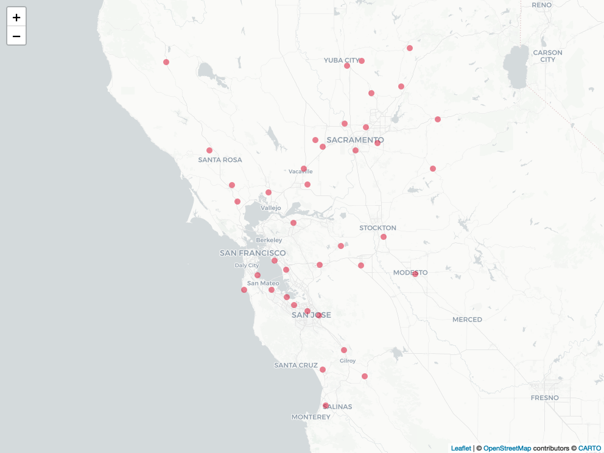
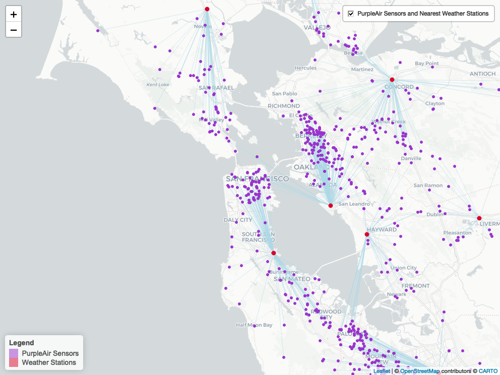

Weather Data
================

### Iowa Environmental Mesonet (IEM)

#### Automated Airport Weather Observations

Load required libraries

``` r
library(riem)          # Download weather station data
library(dplyr)         # Data manipulation
library(sf)            # Spatial data manipulation
library(leaflet)       # Interactive maps
library(htmlwidgets)   # Creating HTML widgets
library(webshot)       # Convert URL to image
library(DataOverviewR) # Data dictionary and summary
```

Define Bay Area bounding box

``` r
# Greater San Francisco area
bbox <- c(xmin = -123.8, ymin = 36.9, xmax = -121.0, ymax = 39.0)

# Convert the bounding box to an sf object and set the CRS (WGS 84)
bbox_sf <- st_as_sfc(st_bbox(bbox))
st_crs(bbox_sf) <- 4326

# Create a buffered area around the bounding box (25 km buffer)
new_bbox_sf <- st_buffer(bbox_sf, 25000)
```

Get weather stations in the Bay Area

``` r
# Networks where name contains "california"
cali_networks <- riem_networks() %>% filter(grepl("California", name, ignore.case = TRUE))
stations <- riem_stations(network = cali_networks$code) %>% select(id,name,elevation,county,lon,lat)

# convert stations to sf object
stations_sf <- st_as_sf(stations, coords = c("lon", "lat"), crs = 4326)

# get intersection of buffer with stations
stations_within_bbox <- st_intersection(stations_sf, new_bbox_sf)

filepath <- file.path("data", "raw", "weather_stations.gpkg") 

st_write(stations_within_bbox, filepath, driver = "GPKG", append=FALSE)
```

Map of Weather Stations in Bay Area

``` r
img_path <- file.path("../docs", "plots", "weather-stations-map.png")
if (!file.exists(img_path)) {
  map_path <- file.path("../docs", "maps", "weather-stations-map.html")
  m <- leaflet() %>%
    addCircleMarkers(data = stations_within_bbox, popup = ~as.character(id), label = ~as.character(id),
                     fillColor = "#d90429", fillOpacity = 0.5, weight = 0, radius = 5) %>%
    addProviderTiles("CartoDB")
  saveWidget(m, file = map_path)
  webshot(map_path, file = img_path)
}
knitr::include_graphics(img_path)
```



Download Weather Station Hourly Data for 2018-2019

``` r
filepath <- file.path("data", "raw", "weather.csv")

if (!file.exists(filepath)) {
  # Initialize empty dataframe to store weather measures for all stations
  measures_df <- data.frame()
  
  # Loop through each weather station within the specified bounding box
  for (id in stations_within_bbox$id) {
    # Get measures for the current station
    measures <- riem_measures(station = id, date_start = "2018-01-01", date_end = "2019-12-31")
    
    if (is.null(measures)) next
    
    # select relevant columns
    measures_subset = measures %>% 
      select(station, valid, tmpf, relh, drct, sknt, gust, lon, lat) %>%
      filter(if_any(c(tmpf, relh, drct, sknt, gust), ~ !is.na(.)))
    
    # Aggregate weather data to hourly intervals and calculate mean for each variable
    measures_subset$timestamp <- format(measures_subset$valid, "%Y-%m-%d %H:00:00")
    
    # Create summary dataframe with hourly averages of weather variables for each station
    summary_df <- measures_subset %>%
      group_by(station, timestamp) %>%
      summarize(
        temp_fahrenheit = mean(tmpf, na.rm = TRUE),
        rel_humidity = mean(relh, na.rm = TRUE),
        wind_direction = mean(drct, na.rm = TRUE),
        wind_speed = mean(sknt, na.rm = TRUE),
        wind_gust = mean(gust, na.rm = TRUE),
        lon = first(lon),
        lat = first(lat),
        .groups = 'drop')
    
    # Add to measures_df
    measures_df <- rbind(measures_df, summary_df)
  }
  
  # Save to CSV file
  write.csv(measures_df, file = filepath, row.names = FALSE)
}
```

------------------------------------------------------------------------

**Data Dictionary**

#### Weather Stations Bay Area Hourly 2018-2019

`588,075` rows

`513,500` rows with missing values

| Column | Type | Description |
|:--:|:--:|:--:|
| station | character | Three or four character site identifier |
| timestamp | character | Timestamp of the observation (UTC) |
| temp_fahrenheit | numeric | Air Temperature in Fahrenheit, typically @ 2 meters |
| rel_humidity | numeric | Relative Humidity in % |
| wind_direction | numeric | Wind Direction in degrees from *true* north |
| wind_speed | numeric | Wind Speed in knots |
| wind_gust | numeric | Wind Gust in knots |
| lon | numeric | Longitude |
| lat | numeric | Latitude |

#### Missing Values

`588,075` rows

`513,500` rows with missing values

|     Column      | NA_Count | NA_Percentage |
|:---------------:|:--------:|:-------------:|
|     station     |    0     |               |
|    timestamp    |    0     |               |
| temp_fahrenheit |  9,514   |      2%       |
|  rel_humidity   |  11,860  |      2%       |
| wind_direction  |  5,113   |      1%       |
|   wind_speed    |  1,216   |      0%       |
|    wind_gust    | 512,330  |      87%      |
|       lon       |    0     |               |
|       lat       |    0     |               |

**View data**

| station | timestamp | temp_fahrenheit | rel_humidity | wind_direction | wind_speed | wind_gust | lon | lat |
|:---|:---|---:|---:|---:|---:|---:|---:|---:|
| AUN | 2018-01-01 00:00:00 | 54.2 | 60.28000 | 23.33333 | 2.666667 | NA | -121.0817 | 38.9548 |
| AUN | 2018-01-01 01:00:00 | 54.2 | 49.44333 | 16.66667 | 1.333333 | NA | -121.0817 | 38.9548 |
| AUN | 2018-01-01 02:00:00 | 52.4 | 52.66000 | 0.00000 | 0.000000 | NA | -121.0817 | 38.9548 |

------------------------------------------------------------------------

Filter out weather stations with insufficient data

``` r
# Count rows of weather data for stations and filter out stations with < 95% rows
keep_stations <- weather_data %>%
  group_by(station) %>%
  summarise(count = n(),
            data_prop = n()/length(unique(weather_data$timestamp)), .groups = 'drop') %>% 
  filter(data_prop >= 0.95) %>% 
  pull(station)

stations <- weather_data %>% filter(station %in% keep_stations) %>% select(station, lon, lat) %>% distinct()
stations_sf <- st_as_sf(stations, coords=c("lon", "lat"), crs = 4326)
st_write(stations_sf, 
         file.path("data", "raw", "stations_sf.gpkg"),
         driver = "GPKG", append = FALSE, quiet = TRUE)
```

Link Nearest Weather Stations to PurpleAir sensors

``` r
filepath <- file.path("data", "processed", "weatherstations_purpleair.csv")
if (!file.exists(filepath)) {
  # Find the index of the nearest weather station for each sensor
  nearest_station_index <- st_nearest_feature(pa_sf, stations_sf)
  
  # Calculate the distance to the nearest weather station for each sensor
  distances <- st_distance(pa_sf, stations_sf[nearest_station_index, ], by_element = TRUE)
  
  # Add nearest weather stations and distances to PurpleAir data frame
  pa_sf$station <- stations_sf$station[nearest_station_index]
  pa_sf$station_distance <- as.numeric(distances)
  
  weather_pa <- pa_sf %>% st_drop_geometry()
  
  # Save PurpleAir sensors and weather stations
  write.csv(weather_pa, filepath, row.names = FALSE)
}
weather_pa <- read.csv(filepath)
pa_sf <- st_as_sf(pa_sensors, coords=c("longitude", "latitude"), crs = 4326) %>% select(sensor_index)
pa_sf <- left_join(pa_sf, weather_pa, by = "sensor_index")
```

Map of PurpleAir sensors and nearest weather stations

``` r
img_path <- file.path("../docs", "plots", "pa-weather-map.png")
if (!file.exists(img_path)) {
  map_path <- file.path("../docs", "maps", "pa-weather-map.html")
  # Convert weather stations to a data frame
  weather_stations_df <- as.data.frame(st_coordinates(stations_sf))
  colnames(weather_stations_df) <- c("wlon", "wlat")
  weather_stations_df$weatherstation <- stations_sf$station
  
  # Convert filtered sensors to a data frame
  filtered_sensors_df <- as.data.frame(st_coordinates(pa_sf))
  colnames(filtered_sensors_df) <- c("plon", "plat")
  filtered_sensors_df$sensor_index <- pa_sf$sensor_index
  filtered_sensors_df$weatherstation <- pa_sf$station
  
  # Join filtered sensors and weather stations data frames
  result <- left_join(filtered_sensors_df, weather_stations_df, by = "weatherstation")
  
  # Connect sensors with closest weather stations with lines
  sensor_coords <- result[, c("plon", "plat")]
  names(sensor_coords) <- c("long", "lat")
  station_coords <- result[, c("wlon", "wlat")]
  names(station_coords) <- c("long", "lat")
  
  # Add lines as geometry
  result$geometry <- do.call("c", lapply(seq(nrow(sensor_coords)), function(i) {
    st_sfc(st_linestring(as.matrix(rbind(sensor_coords[i, ], station_coords[i, ]))), crs = 4326)
  }))
  
  # Convert the result to a simple feature object
  closest_station <- st_as_sf(result)
  
  # save closest stations lines
  st_write(closest_station, 
           file.path("data", "raw", "closest_station.gpkg"),
           driver = "GPKG", append = FALSE, quiet = TRUE)
  
  # Map of PurpleAir sensors and nearest weather stations
  m <- leaflet() %>%
    addPolylines(data = closest_station, color = "lightblue", weight = 0.5, opacity = 1) %>%
    addCircleMarkers(data = pa_sf, popup = ~paste("Sensor Index:", sensor_index),
                     fillColor = "#9933CC", fillOpacity = 1, 
                     color = "#9933CC", weight = 2, opacity = 1, radius = 2) %>%
    addCircleMarkers(data = stations_sf, popup = ~paste("Weather Station:", station),
                     fillColor = "#d90429", fillOpacity = 1, 
                     color = "#d90429", weight = 3, opacity = 1, radius = 3) %>%
    addProviderTiles("CartoDB") %>%
    addLayersControl(overlayGroups = c("PurpleAir Sensors and Nearest Weather Stations"),
                     options = layersControlOptions(collapsed = FALSE)) %>%
    addLegend(colors = c("#9933CC", "#d90429"),
              labels = c("PurpleAir Sensors", "Weather Stations"),
              title = "Legend", position = "bottomleft") %>%
    setView(lng = -122.44, lat = 37.76, zoom = 10)
  saveWidget(m, file = map_path)
  webshot(map_path, file = img_path)
}

knitr::include_graphics(img_path)
```


