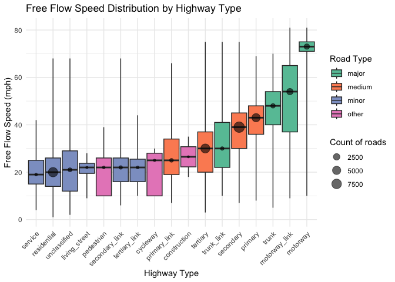

Uber Speeds data
================

Load required libraries

``` r
library(dplyr)         # Data manipulation
library(data.table)    # Working with large files
library(DataOverviewR) # Data dictionary and summary
library(ggplot2)
```

------------------------------------------------------------------------

**Data Dictionary**

#### Uber Movement Speeds - Jan 2018

`24,074,530` rows

`0` rows with missing values

| Column | Type | Description |
|:--:|:--:|:--:|
| year | integer | Year. |
| month | integer | Month. |
| day | integer | Day. |
| hour | integer | Hour in 24-hour format. |
| utc_timestamp | POSIXct | Timestamp in Coordinated Universal Time (UTC) |
| segment_id | character | Unique identifier for the road segment on which the speed is measured. |
| start_junction_id | character | Unique identifier for the starting junction (node) of the road segment. |
| end_junction_id | character | Unique identifier for the ending junction (node) of the road segment. |
| osm_way_id | integer | OpenStreetMap (OSM) ID for the road segment or way. |
| osm_start_node_id | integer64 | OpenStreetMap (OSM) ID for the starting node of the segment. |
| osm_end_node_id | integer64 | OpenStreetMap (OSM) ID for the ending node of the segment. |
| speed_mph_mean | numeric | Mean speed in miles per hour recorded on the segment during the observation period. |
| speed_mph_stddev | numeric | Standard deviation of the speed in miles per hour recorded on the segment during the observation period. |

**View data**

| year | month | day | hour | utc_timestamp | segment_id | start_junction_id | end_junction_id | osm_way_id | osm_start_node_id | osm_end_node_id | speed_mph_mean | speed_mph_stddev |
|---:|---:|---:|---:|:---|:---|:---|:---|---:|---:|---:|---:|---:|
| 2018 | 1 | 1 | 1 | 2018-01-01 09:00:00 | 8f4827ebed3c2e66f50daef967d5e91daadd8d98 | 8e555723c3dff79036c7a8c0cef6b32a80763c9f | 2278ad9374ec96c35a0d769bc8a275f6355b55da | 40722998 | 62385707 | 4927951349 | 28.153 | 7.468 |
| 2018 | 1 | 26 | 23 | 2018-01-27 07:00:00 | 8f4827ebed3c2e66f50daef967d5e91daadd8d98 | 8e555723c3dff79036c7a8c0cef6b32a80763c9f | 2278ad9374ec96c35a0d769bc8a275f6355b55da | 40722998 | 62385707 | 4927951349 | 30.030 | 10.373 |
| 2018 | 1 | 19 | 19 | 2018-01-20 03:00:00 | 8f4827ebed3c2e66f50daef967d5e91daadd8d98 | 8e555723c3dff79036c7a8c0cef6b32a80763c9f | 2278ad9374ec96c35a0d769bc8a275f6355b55da | 40722998 | 62385707 | 4927951349 | 15.358 | 10.138 |

------------------------------------------------------------------------

### Processing Uber roads

Write Uber 2018 to monthly files

``` r
# Set chunk size
chunk_size <- 10000000

# Process file in chunks
offset <- 0

while(FALSE) {
  # Read chunk
  chunk <- fread(file.path("data", "raw", "uber_2018.csv"), 
                 skip = offset, 
                 nrows = chunk_size)
  names(chunk) <- c("utc_timestamp", "osm_way_id", "speed_mph_mean")
  
  # Break if no more data
  if(nrow(chunk) == 0) break
  
  # Extract month without converting to date (more memory efficient)
  chunk[, month := as.numeric(substr(utc_timestamp, 6, 7))]
  
  # Append each month's data to respective files
  for(m in 1:12) {
    month_data <- chunk[month == m]
    if(nrow(month_data) > 0) {
      # Remove month column before writing
      month_data[, month := NULL]
      fwrite(month_data, 
             file.path("data", "processed", "Uber", sprintf("uber2018_%02d.csv", m)),
             append = TRUE)
    }
  }
  
  # Update offset and print progress
  offset <- offset + chunk_size
  cat(sprintf("Processed %d rows...\n", offset))
  
  # Clear memory
  rm(chunk, month_data)
  gc()
}
```

Write Uber 2019 to monthly files

``` r
# Set chunk size
chunk_size <- 10000000

# Process file in chunks
offset <- 0

while(FALSE) {
  # Read chunk
  chunk <- fread(file.path("data", "raw", "uber_2019.csv"), 
                 skip = offset, 
                 nrows = chunk_size)
  names(chunk) <- c("utc_timestamp", "osm_way_id", "speed_mph_mean")
  
  # Break if no more data
  if(nrow(chunk) == 0) break
  
  # Extract month without converting to date (more memory efficient)
  chunk[, month := as.numeric(substr(utc_timestamp, 6, 7))]
  
  # Append each month's data to respective files
  for(m in 1:12) {
    month_data <- chunk[month == m]
    if(nrow(month_data) > 0) {
      # Remove month column before writing
      month_data[, month := NULL]
      fwrite(month_data, 
             file.path("data", "processed", "Uber", sprintf("uber2019_%02d.csv", m)),
             append = TRUE)
    }
  }
  
  # Update offset and print progress
  offset <- offset + chunk_size
  cat(sprintf("Processed %d rows...\n", offset))
  
  # Clear memory
  rm(chunk, month_data)
  gc()
}
```

Read file: Unique roads surrounding purpleair sensors

``` r
# osm roads surrounding purple air sensors
# columns: sensor_index, osm_id, highway
osm_roads <- fread(file.path("data", "processed", "osm_roads.csv"))
unique_roads <- unique(osm_roads$osm_id)
```

Free flow speeds per road

``` r
# Initialize an empty data table to store the top 5% rows
top_5_percent <- data.table()

# Iterate through all months
for (m in 1:12) {
  # Read the monthly file (columns: utc_timestamp, osm_way_id, speed_mph_mean)
  monthly_data <- fread(
    file.path("data", "processed", "Uber",
              paste0("uber2018_", sprintf("%02d", m), ".csv")))
  
  # Filter to keep only roads in your unique_roads dataset
  monthly_data <- monthly_data[osm_way_id %in% unique_roads]
  
  # Calculate the threshold for the top 5% of speeds
  monthly_top_5 <- monthly_data[, .SD[order(-speed_mph_mean)][1:ceiling(0.05 * .N)], by = osm_way_id]
  
  # Append the top 5% rows to the result data table
  top_5_percent <- rbind(top_5_percent, monthly_top_5, fill = TRUE)
  
  # Remove the current month's data to save memory
  rm(monthly_data)
  gc()  # Trigger garbage collection
}

# Calculate free flow speed (95th percentile) for each osm_way_id
top_5_percent[, speed_mph_mean := as.numeric(speed_mph_mean)]

free_flow_speed <- top_5_percent[, .(free_flow_speed = round(quantile(speed_mph_mean, 0.95, na.rm = TRUE))), by = osm_way_id]

# Save the result
fwrite(free_flow_speed, file.path("data", "processed", "Uber", "free_flow_speeds.csv"))
```

Group OSM road types using free flow speeds of highway types

``` r
# drop sensor_index (causes duplicate roads)
roads_data <- osm_roads %>% 
  select(osm_id, highway) %>% 
  distinct() %>%
  mutate(osm_id = as.numeric(osm_id))

roads_data <- left_join(roads_data, free_flow_speed, by = c("osm_id" = "osm_way_id"))

roads_analysis <- roads_data %>% 
  select(osm_id, highway, free_flow_speed) %>% 
  distinct() %>% 
  group_by(highway) %>% 
  filter(!is.na(free_flow_speed)) %>%
  summarise(
    min_f = min(free_flow_speed, na.rm = TRUE),
    f25 = quantile(free_flow_speed, 0.25, na.rm = TRUE),
    median_f = median(free_flow_speed, na.rm = TRUE),
    f75 = quantile(free_flow_speed, 0.75, na.rm = TRUE),
    max_f = max(free_flow_speed, na.rm = TRUE),
    countf = n()
  ) %>%
  mutate(road_type = case_when(
    highway %in% c("motorway", "motorway_link", "trunk", "trunk_link") ~ "major",
    highway %in% c("primary", "primary_link", "secondary", "tertiary") ~ "medium",
    highway %in% c("residential", "unclassified", "service", "living_street", 
                   "secondary_link", "tertiary_link") ~ "minor",
    TRUE ~ "other"
  )) %>% arrange(road_type, desc(countf))
```

Box plot to decide on road type grouping

``` r
# Boxplot to decide on road type grouping (using free flow speeds)
ggplot(roads_analysis, aes(x = reorder(highway, median_f), y = median_f)) +
  geom_boxplot(
    aes(ymin = min_f, lower = f25, middle = median_f, upper = f75,
        ymax = max_f, fill = road_type), stat = "identity") +
  geom_point(aes(size = countf), color = "black", alpha = 0.6) +
  scale_fill_brewer(palette = "Set2") +
  scale_size_continuous(name = "Count of roads") +
  theme_minimal() +
  theme(axis.text.x = element_text(angle = 45, hjust = 1)) +
  labs(title = "Free Flow Speed Distribution by Highway Type",
       x = "Highway Type", y = "Free Flow Speed (mph)", fill = "Road Type")
```

<!-- -->

Calculate hourly congestion & speeds for each purpleair sensor & road
type

``` r
if (!file.exists(file.path("data", "processed", "speeds_data.csv"))) {
  
  all_months <- list()
  counter <- 1
  for (y in c("2018_", "2019_")) {
    for (m in 1:12) {
      # Read the monthly file (columns: utc_timestamp, osm_way_id, speed_mph_mean)
      monthly_data <- fread(file.path("data", "processed", "Uber", paste0(
        "uber", y, sprintf("%02d", m), ".csv")))
      
      # Filter to keep only roads surrounding purple air sensors
      monthly_data <- monthly_data[osm_way_id %in% unique_roads]
      
      # join to get free_flow_speed column
      monthly_data <- left_join(monthly_data, free_flow_speed, by = c("osm_way_id"))
      
      # join to get sensor_index & highway columns
      monthly_data <- left_join(monthly_data, osm_roads, by = c("osm_way_id" = "osm_id"))
      
      # categorize roads by type
      monthly_data <- monthly_data %>% 
        mutate(road_type = case_when(
          highway %in% c("motorway", "motorway_link", "trunk", "trunk_link") ~ "major",
          highway %in% c("primary", "primary_link", "secondary", "tertiary") ~ "moderate",
          highway %in% c("residential", "unclassified", "service", "living_street",
                         "secondary_link", "tertiary_link") ~ "minor",
          TRUE ~ "minor"
        ))
      
      # congestion and speed aggregated by sensor and road type (hourly)
      monthly_agg <- monthly_data %>% 
        mutate(congestion_ratio = speed_mph_mean / free_flow_speed) %>% 
        group_by(utc_timestamp, sensor_index, road_type) %>%
        summarize(
          mean_congestion = round(mean(congestion_ratio, na.rm = TRUE), 3),
          mean_speed = round(mean(speed_mph_mean, na.rm = TRUE), 1),
          n_measurements = n()
        ) %>%
        ungroup()
      
      # Pivot wider to get one row per sensor-hour
      monthly_wide <- monthly_agg %>%
        pivot_wider(
          id_cols = c(utc_timestamp, sensor_index),
          names_from = road_type,
          values_from = c(mean_congestion, mean_speed, n_measurements),
          values_fill = list(mean_congestion = NA, mean_speed = NA, n_measurements = 0)
        )
      
      # Store in list
      all_months[[counter]] <- monthly_wide
      counter <- counter + 1
    }
  }
  # Combine all months
  speeds_data <- rbindlist(all_months, fill = TRUE)
  
  # Save final dataset
  fwrite(speeds_data, file.path("data", "processed", "speeds_data.csv"))
}
```

------------------------------------------------------------------------

**Data Dictionary**

#### Processed Uber Movement Speeds

`7,917,416` rows

`6,559,560` rows with missing values

| Column | Type | Description |
|:--:|:--:|:--:|
| utc_timestamp | POSIXct | Timestamp in Coordinated Universal Time (UTC). |
| sensor_index | integer | PurpleAir sensor unique identifier. |
| mean_congestion_major | numeric | Average congestion ratio on major roads (e.g., motorways, trunk). |
| mean_congestion_moderate | numeric | Average congestion ratio on moderate roads (e.g., primary, secondary, tertiary). |
| mean_congestion_minor | numeric | Average congestion ratio on minor roads (e.g., residential, unclassified). |
| mean_speed_major | numeric | Average speed (mph) on major roads. |
| mean_speed_moderate | numeric | Average speed (mph) on moderate roads. |
| mean_speed_minor | numeric | Average speed (mph) on minor roads. |
| n_measurements_major | integer | Number of measurements for major roads. |
| n_measurements_moderate | integer | Number of measurements for moderate roads. |
| n_measurements_minor | integer | Number of measurements for minor roads. |

`7,917,416` rows

`6,559,560` rows with missing values

|          Column          | NA_Count  | NA_Percentage |
|:------------------------:|:---------:|:-------------:|
|      utc_timestamp       |     0     |               |
|       sensor_index       |     0     |               |
|  mean_congestion_major   | 3,419,020 |      43%      |
| mean_congestion_moderate | 1,212,957 |      15%      |
|  mean_congestion_minor   | 5,430,146 |      69%      |
|     mean_speed_major     | 3,419,014 |      43%      |
|   mean_speed_moderate    | 1,212,826 |      15%      |
|     mean_speed_minor     | 5,428,580 |      69%      |
|   n_measurements_major   |     0     |               |
| n_measurements_moderate  |     0     |               |
|   n_measurements_minor   |     0     |               |

**View data**

| utc_timestamp | sensor_index | mean_congestion_major | mean_congestion_moderate | mean_congestion_minor | mean_speed_major | mean_speed_moderate | mean_speed_minor | n_measurements_major | n_measurements_moderate | n_measurements_minor |
|:---|---:|---:|---:|---:|---:|---:|---:|---:|---:|---:|
| 2018-01-01 08:00:00 | 767 | 0.863 | 0.921 | NA | 58.2 | 36.7 | NA | 30 | 40 | 0 |
| 2018-01-01 08:00:00 | 1004 | NA | 1.047 | NA | NA | 23.9 | NA | 0 | 42 | 0 |
| 2018-01-01 08:00:00 | 1874 | 0.863 | NA | NA | 59.6 | NA | NA | 10 | 0 | 0 |

------------------------------------------------------------------------
