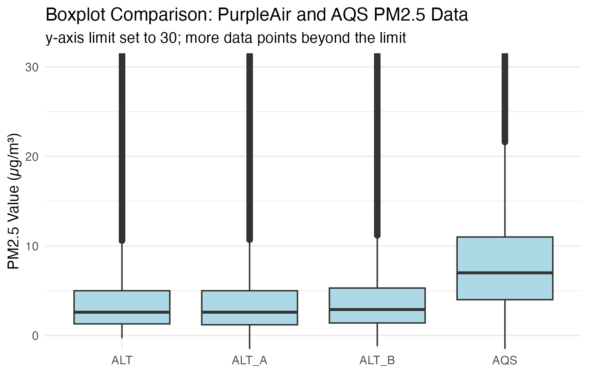
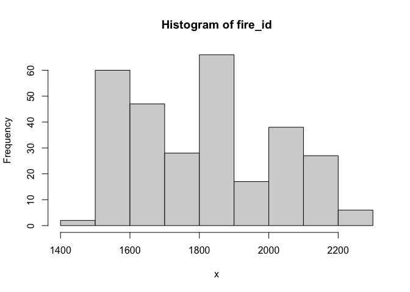
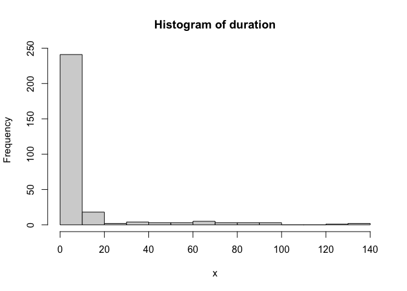
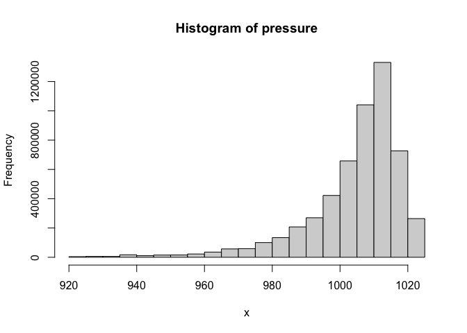
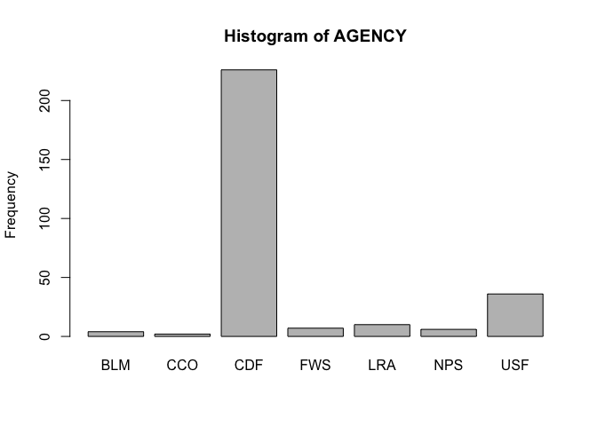
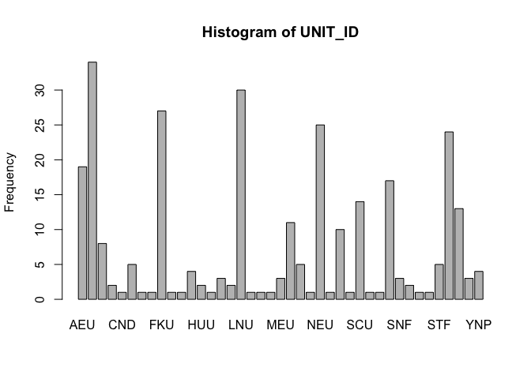
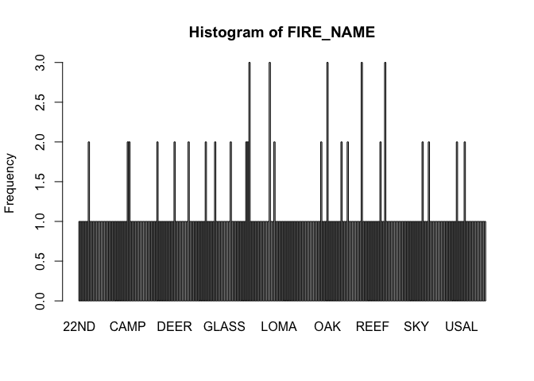
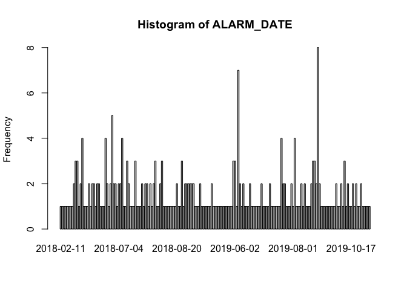
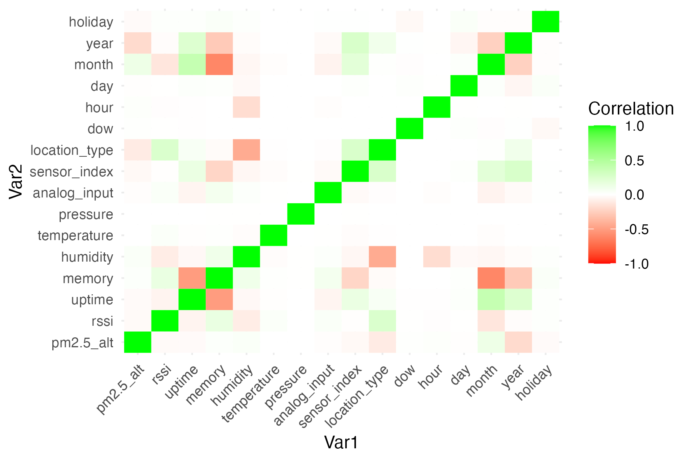
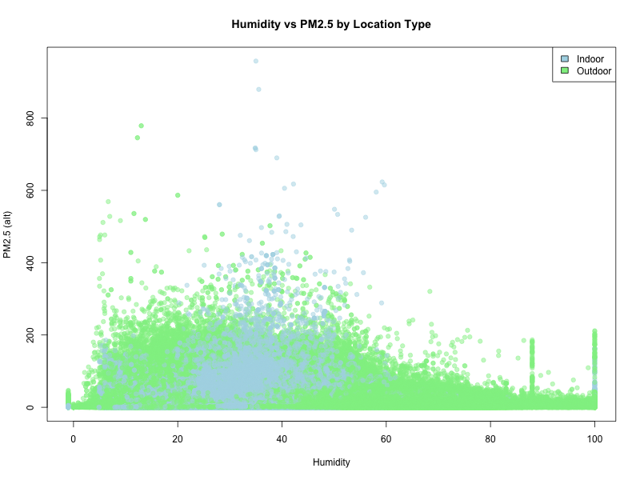

Exploratory Data Analysis: PurpleAir
================

------------------------------------------------------------------------

**Data Summary**

## **Purple Air Summary**

`5,982,095` rows

`1,445,842` rows with missing values

| Variable | Mean | Min | P25 | Median | P75 | Max | NA_Count | NA_Percentage |
|:--:|:--:|:--:|:--:|:--:|:--:|:--:|:--:|:--:|
| rssi | -63.14 | -97.00 | -74.00 | -65.00 | -56.00 | 31.0 | 5,136 | 0% |
| uptime | 715,541.04 | 0.00 | 29,078.00 | 230,220.00 | 1,141,980.00 | 4,293,194.0 | 5,136 | 0% |
| memory | 24,127.32 | 5,063.00 | 19,525.00 | 20,679.00 | 30,382.00 | 340,251.0 | 2,395 | 0% |
| humidity | 43.39 | -1.00 | 31.30 | 41.76 | 56.27 | 100.0 | 87,220 | 1% |
| temperature | 692,701.16 | -232.00 | 62.67 | 72.76 | 81.71 | 2,147,483,647.0 | 87,220 | 1% |
| pressure | 1,002.87 | 42.51 | 999.44 | 1,008.44 | 1,013.65 | 1,362,358.5 | 468,104 | 8% |
| analog_input | 0.02 | -1.00 | 0.01 | 0.02 | 0.03 | 0.1 | 2,635 | 0% |
| pm2.5_alt | 5.01 | -0.30 | 1.30 | 2.60 | 5.00 | 957.6 | 884 | 0% |
| pm2.5_alt_a | 5.01 | -7.60 | 1.20 | 2.60 | 5.00 | 1,052.2 | 2,340 | 0% |
| pm2.5_alt_b | 5.40 | -1.20 | 1.40 | 2.90 | 5.30 | 1,001.1 | 1,005,212 | 17% |
| sensor_index | 17,510.21 | 767.00 | 13,173.00 | 19,281.00 | 21,707.00 | 44,983.0 | 0 |  |
| location_type | 0.26 | 0.00 | 0.00 | 0.00 | 1.00 | 1.0 | 0 |  |

numeric

| Variable | Min | Max | Median | N_Unique | NA_Count | NA_Percentage |
|:--:|:--:|:--:|:--:|:--:|:--:|:--:|
| time_stamp | 2018-01-01 | 2019-12-31 22:00:00 | 2019-07-08 16:00:00 | 17,519 | 0 |  |

posixct

------------------------------------------------------------------------

Comparing PurpleAir air quality measurements with AQS

| Quantiles     | 75% | 95% | 99% | 99.9% |  max |
|:--------------|----:|----:|----:|------:|-----:|
| AQS PM2.5     |  11 |  23 |  63 |   165 |  634 |
| PurpleAir ALT |   5 |  16 |  43 |   145 |  958 |
| Channel A ALT |   5 |  16 |  44 |   145 | 1052 |
| Channel B ALT |   5 |  17 |  48 |   151 | 1001 |

Box Plots



Plot Sensors by Month


Create temporal features

``` r
# Get holidays for 2018 and 2019
holidays <- as.Date(c(holidayNYSE(2019), holidayNYSE(2018)))

purpleair_data <- purpleair_data %>%
  mutate(
    time_stamp = lubridate::as_datetime(time_stamp),
    local_timestamp = with_tz(time_stamp, tzone = "America/Los_Angeles"),
    local_date = as.Date(local_timestamp, tz="America/Los_Angeles"),
    dow = lubridate::wday(local_timestamp),
    hour = lubridate::hour(local_timestamp),
    day = lubridate::day(local_timestamp),
    month = lubridate::month(local_timestamp),
    year = lubridate::year(local_timestamp),
    holiday = ifelse(local_date %in% holidays, 1, 0)
  ) %>% select(-local_timestamp, -local_date)
```

Histograms for numerical columns

<!-- --><!-- --><!-- --><!-- --><!-- --><!-- --><!-- --><!-- --><!-- --><!-- -->

Bar Plots for categorical columns

<!-- --><!-- --><!-- --><!-- --><!-- --><!-- --><!-- -->

ALT: Channel A vs B


Check associations between variables





<!-- purpleair_data$outlier_flag <- ifelse(abs(pm2.5_alt_a - pm2.5_alt_b) / pm2.5_alt > threshold | is.na(pm2.5_alt_a) | is.na(pm2.5_alt_b), 1, 0) -->
<!-- ## Flag outliers with different thresholds of relative change between channel A and B -->
<!-- ### Relative Change -->
<!-- \[ -->
<!-- \text{Relative Change} = \frac{\lvert \text{Channel A}_{\text{PM2.5}} - \text{Channel B}_{\text{PM2.5}} \rvert}{\text{avg}(\text{Channel A}_{\text{PM2.5}}, \text{Channel B}_{\text{PM2.5}})} -->
<!-- \] -->
<!-- ### Minimum *Absolute Difference* between A and B must be greater than 2 -->
<!-- ```{r, flag-outliers-thres} -->
<!-- # flag outliers using different thresholds and compare -->
<!-- # Initialize an empty data frame to store results -->
<!-- outlier_summary <- data.frame( -->
<!--   threshold = numeric(0), -->
<!--   num_outliers = numeric(0), -->
<!--   percentage = numeric(0) -->
<!-- ) -->
<!-- # Set thresholds for PM2.5 relative change  -->
<!-- # Relative change - Arithmetic mean change (https://en.wikipedia.org/wiki/Relative_change#Indicators_of_relative_change) -->
<!-- thresholds <- c(0.1, 0.15, 0.2, 0.25, 0.3, 0.4, 0.5, 0.6) -->
<!-- for (threshold in thresholds) { -->
<!--   outliers <- purpleair_data %>% -->
<!--     mutate(abs_diff = abs(pm2.5_atm_a - pm2.5_atm_b), -->
<!--            relativechange = round(abs_diff / pm2.5_atm, 2), -->
<!--            flag = ifelse(flag == "Normal" & relativechange > threshold & abs_diff > 2, -->
<!--                          "Outlier", flag)) -->
<!--   # Merge with original data and flag outliers -->
<!--   pa_outliers <- purpleair_data %>% select(-flag) %>% -->
<!--     left_join(outliers %>% select(time_stamp, sensor_index, flag, abs_diff, relativechange),  -->
<!--               by = c("time_stamp", "sensor_index")) %>% -->
<!--     select(time_stamp, pm2.5_atm_a, pm2.5_atm_b, abs_diff, relativechange, -->
<!--            flag, everything()) -->
<!--   num_outliers <- pa_outliers %>% filter(flag == "Outlier") %>% nrow() -->
<!--   percentage <- paste0(round(100 * num_outliers / total_rows, 2),"%") -->
<!--   # Add the results to the data frame -->
<!--   outlier_summary <- rbind(outlier_summary,  -->
<!--                            data.frame(threshold = threshold,  -->
<!--                                       num_outliers = format(num_outliers, big.mark = ","),  -->
<!--                                       percentage = percentage)) -->
<!-- } -->
<!-- ``` -->
<!-- ```{r, view-outlier-thres, echo = FALSE} -->
<!-- knitr::kable(outlier_summary, -->
<!--              row.names = FALSE, -->
<!--              format = "markdown", -->
<!--              col.names = c("Threshold", "Number of Outliers", "Percentage")) %>% -->
<!--   kable_styling() %>% -->
<!--   row_spec(1, bold = TRUE, background = "#FFFF99") -->
<!-- ``` -->
<!-- ## Plot different thresholds to compare -->
<!-- ```{r, plot-outliers-thres, echo=FALSE, out.width="49%", out.height="20%", fig.show='hold', fig.align='center'} -->
<!-- if (FALSE) { -->
<!--   for (threshold in thresholds) { -->
<!--     outliers <- purpleair_data %>% -->
<!--       mutate(abs_diff = abs(pm2.5_atm_a - pm2.5_atm_b), -->
<!--              relativechange = round(abs_diff / pm2.5_atm, 2), -->
<!--              flag = ifelse(flag == "Normal" & relativechange > threshold & abs_diff > 2, -->
<!--                            "Outlier", flag)) -->
<!--     # Merge with original data and flag outliers -->
<!--     pa_outliers <- purpleair_data %>% select(-flag) %>% -->
<!--       left_join(outliers %>% select(time_stamp, sensor_index, flag, abs_diff, relativechange),  -->
<!--                 by = c("time_stamp", "sensor_index")) %>% -->
<!--       select(time_stamp, pm2.5_atm_a, pm2.5_atm_b, abs_diff, relativechange, -->
<!--              flag, everything()) -->
<!--     p <- ggplot(pa_outliers, aes(x = pm2.5_atm_a, y = pm2.5_atm_b, color = flag)) + -->
<!--       geom_point() + -->
<!--       scale_color_manual(values = c("Normal" = "black", "Outlier" = "grey", -->
<!--                                     "Missing" = "red", "PM2.5 > 500" = "orange"), -->
<!--                          name = "") +  -->
<!--       labs(x = "Channel A PM2.5", -->
<!--            y = "Channel B PM2.5", -->
<!--            color = "Flag", -->
<!--            title = paste0("Threshold = ", threshold), -->
<!--            subtitle = paste0("PM2.5 Channel A vs B\n", -->
<!--                              "Axes limits set to 1000; more data points beyond the limit")) + -->
<!--       theme_minimal() + -->
<!--       xlim(-1, 1000) + -->
<!--       ylim(-1, 1000) -->
<!--     ggsave(filename = paste0(preprocessing_directory, "/plots/plot_threshold_", threshold, ".png"), -->
<!--            plot = p, width = 6, height = 4) -->
<!--   } -->
<!-- } -->
<!-- # compare plots of different thresholds -->
<!-- img_paths <- c() -->
<!-- for (threshold in c(0.1, 0.15, 0.2, 0.25, 0.3, 0.4, 0.5, 0.6)) { -->
<!--   img_path <- paste0(preprocessing_directory, "/plots/plot_threshold_", threshold, ".png") -->
<!--   img_paths <- c(img_paths, img_path) -->
<!-- } -->
<!-- knitr::include_graphics(img_paths) -->
<!-- ``` -->
<!-- ## Using threshold of 0.1 relative change between channel A and B -->
<!-- ## And maximum value of PM2.5 500 for channel A and B -->
<!-- ```{r, flag-outliers} -->
<!-- # flag outliers using selected threshold -->
<!-- threshold = 0.1 -->
<!-- outliers <- purpleair_data %>% -->
<!--   mutate(abs_diff = abs(pm2.5_atm_a - pm2.5_atm_b), -->
<!--          relativechange = round(abs_diff / pm2.5_atm, 2), -->
<!--          flag = ifelse(flag == "Normal" & relativechange > threshold & abs_diff > 2, -->
<!--                        "Outlier", flag)) -->
<!-- # Merge with flagged and original data -->
<!-- pa_outliers <- purpleair_data %>% select(-flag) %>% -->
<!--   left_join(outliers %>% select(time_stamp, sensor_index, flag, abs_diff, relativechange),  -->
<!--             by = c("time_stamp", "sensor_index")) %>% -->
<!--   select(time_stamp, pm2.5_atm_a, pm2.5_atm_b, abs_diff, relativechange, flag, everything()) -->
<!-- outliers %>% select(pm2.5_atm, pm2.5_atm_a, pm2.5_atm_b, abs_diff, relativechange) %>% filter(relativechange < threshold) %>% arrange(desc(abs_diff)) -->
<!-- ``` -->
<!-- ```{r, include = FALSE} -->
<!-- # # For checking specific examples -->
<!-- # options(digits=2) -->
<!-- #  -->
<!-- # x <- pa_outliers %>%  filter(!is.na(pm2.5_atm_a), !is.na(pm2.5_atm_b)) %>% -->
<!-- #     select(time_stamp, pm2.5_atm_a, pm2.5_atm_b, abs_diff, relativechange, outlier, everything()) -->
<!-- # x %>% filter(outlier==0) %>% slice_sample(n=10) %>% arrange(abs_diff) -->
<!-- # x %>% filter(outlier==1) %>% slice_sample(n=20) %>% arrange(abs_diff) -->
<!-- # x %>% sample_n(size=20, fac=pm2.5_atm) %>% arrange(outlier, abs_diff) -->
<!-- # x %>% sample_n(size=20, fac=relativechange) %>% arrange(outlier, abs_diff) -->
<!-- # x %>% filter(outlier==0, pm2.5_atm>100, abs_diff>10) %>% slice_sample(n=20) %>% arrange(abs_diff) -->
<!-- # x %>% filter(outlier==0, pm2.5_atm<150) %>% arrange(desc(abs_diff)) -->
<!-- ``` -->
<!-- ## Filter out high PM2.5 values (>500), missing channel data, and identified outliers -->
<!-- ```{r, remove-outliers} -->
<!-- # Remove outliers and keep relevant columns -->
<!-- pa_filtered <- pa_outliers %>%  -->
<!--   filter(flag == "Normal") %>% -->
<!--   select(time_stamp, sensor_index, pm2.5_atm, pm2.5_atm_a, pm2.5_atm_b, -->
<!--          rssi, uptime, memory, humidity, temperature, pressure, analog_input) -->
<!-- ``` -->
<!-- ## Remove sensors with < 24 data points -->
<!-- ```{r, low-data-sensors} -->
<!-- low_data_sensors <- pa_filtered %>%  -->
<!--   group_by(sensor_index) %>% summarize(n = n()) %>% arrange(n) %>% filter(n < 24) -->
<!-- pa_filtered <- pa_filtered %>%  -->
<!--   filter(!(sensor_index %in% low_data_sensors$sensor_index)) -->
<!-- ``` -->
<!-- ```{r, channel-a-b-plot, eval = TRUE, warning=FALSE} -->
<!-- if (FALSE) { -->
<!--   p <- ggplot(pa_filtered, aes(x = pm2.5_atm_a, y = pm2.5_atm_b)) + -->
<!--     geom_point() + -->
<!--     labs(x = "Channel A PM2.5", -->
<!--          y = "Channel B PM2.5", -->
<!--          title = "PM2.5 Channel A vs B") + -->
<!--     theme_minimal() -->
<!--   ggsave(filename = paste0(preprocessing_directory, "/plots/pa_filtered.png"), -->
<!--          plot = p, width = 6, height = 4) -->
<!-- } -->
<!-- img_path <- paste0(preprocessing_directory, "/plots/pa_filtered.png") -->
<!-- knitr::include_graphics(img_path) -->
<!-- ``` -->
<!-- ## Remove 24 hour periods of zeros or missing data -->
<!-- ```{r, rolling-zeros-missing} -->
<!-- start_time <- min(pa_filtered$time_stamp, na.rm = TRUE) -->
<!-- end_time <- max(pa_filtered$time_stamp, na.rm = TRUE) -->
<!-- all_timestamps <- seq(from = start_time, to = end_time, by = "hour") -->
<!-- all_sensor_indices <- unique(pa_filtered$sensor_index) -->
<!-- complete_timestamps <- expand.grid(sensor_index = all_sensor_indices, -->
<!--                                    time_stamp = all_timestamps) -->
<!-- pa_complete <- complete_timestamps %>% -->
<!--   left_join(pa_filtered, by = c("sensor_index", "time_stamp")) %>% -->
<!--   mutate(pm2.5_atm = ifelse(is.na(pm2.5_atm), -1, pm2.5_atm)) -->
<!-- pa_complete <- pa_complete %>% -->
<!--   group_by(sensor_index) %>% -->
<!--   mutate( -->
<!--     is_zero_or_missing = ifelse(pm2.5_atm == 0 | pm2.5_atm == -1, 1, 0), -->
<!--     is_normal = ifelse(pm2.5_atm != 0 & pm2.5_atm != -1, 1, 0), -->
<!--     rolling_zeros_missing = rollapply(is_zero_or_missing, width = 24, FUN = sum, -->
<!--                                       align = "right", fill = NA), -->
<!--     rolling_normals = rollapply(is_normal, width = 24, FUN = sum, align = "right", fill = NA) -->
<!--   ) %>% -->
<!--   ungroup() -->
<!-- # threshold 0.8 means >=20 hours missing from a 24 hour time period -->
<!-- pa_complete <- pa_complete %>% -->
<!--   mutate( -->
<!--     proportion_zeros_missing = rolling_zeros_missing / 24, -->
<!--     flag_high_proportion = ifelse(proportion_zeros_missing >= 0.8, 1, 0) -->
<!--   )  -->
<!-- pa_complete <- pa_complete %>% filter(flag_high_proportion != 1) %>% -->
<!--   select(-is_zero_or_missing, -is_normal, -rolling_zeros_missing, -->
<!--          -rolling_normals, -proportion_zeros_missing, -flag_high_proportion) -->
<!-- ``` -->
<!-- ## Plot sensors with >20% zeros  -->
<!-- ```{r, perc-zeros} -->
<!-- # Percentage of zero readings for each sensor -->
<!-- sensor_zero_readings <- pa_complete %>% -->
<!--   group_by(sensor_index) %>% -->
<!--   summarize(pct_zeros = round(100 * sum(pm2.5_atm == 0) / n(), 2), -->
<!--             pct_missing = round(100 * sum(pm2.5_atm == -1) / n(), 2)) %>% -->
<!--   filter(pct_zeros > 20) -->
<!-- # Loop through each sensor and create plots -->
<!-- for (i in 1:nrow(sensor_zero_readings)) { -->
<!--   s <- sensor_zero_readings$sensor_index[[i]] -->
<!--   data_sensor <- pa_complete %>% filter(sensor_index == s) -->
<!--   n <- nrow(data_sensor) -->
<!--   pz <- round(sensor_zero_readings$pct_zeros[i], 0) -->
<!--   pm <- round(sensor_zero_readings$pct_missing[i], 0) -->
<!--   # Create a data frame with segment information -->
<!--   shifted_readings <- data.frame( -->
<!--     time_stamp = head(data_sensor$time_stamp, -1),  -->
<!--     time_stamp_shifted = tail(data_sensor$time_stamp, -1),  -->
<!--     pm2.5_atm = head(data_sensor$pm2.5_atm, -1),  -->
<!--     pm2.5_atm_shifted = tail(data_sensor$pm2.5_atm, -1) -->
<!--   ) -->
<!--   # Assign colors based on whether the pm2.5_atm value is zero or not -->
<!--   shifted_readings <- shifted_readings %>%  -->
<!--     mutate(flag = ifelse(pm2.5_atm == 0, "Zero", ifelse(pm2.5_atm == -1, "Missing", "Normal"))) -->
<!--   # Plot the segments -->
<!--   p <- ggplot(data=shifted_readings, aes(x=time_stamp, xend = time_stamp_shifted, -->
<!--                                          y=pm2.5_atm, yend = pm2.5_atm_shifted,  -->
<!--                                          color=flag)) + -->
<!--     geom_segment() + -->
<!--     scale_color_manual(values = c("Normal" = "black", "Missing" = "yellow", -->
<!--                                   "Zero" = "red"), -->
<!--                        name = "") +  -->
<!--     labs(x = "Time", y = "PM2.5",  -->
<!--          title = paste0("Sensor ", s, "\n", -->
<!--                         pz, "% zeros", "\n",  -->
<!--                         pm, "% missing", -->
<!--                         "\nNumber of readings: ", n)) + -->
<!--     theme_minimal() -->
<!--   ggsave(filename = file.path(preprocessing_directory, "plots", paste0( -->
<!--     "pct", pz, "_sensor", s, ".png")), -->
<!--     plot = p, width = 8, height = 6) -->
<!-- } -->
<!-- ``` -->
<!-- ## View plots of sensors with >20% zeros -->
<!-- ```{r, zero-plots, echo=FALSE, out.width="49%", out.height="20%", fig.show='hold', fig.align='center'} -->
<!-- # compare plots of different thresholds -->
<!-- img_paths <- c() -->
<!-- for (i in 1:nrow(sensor_zero_readings)) { -->
<!--   s <- sensor_zero_readings$sensor_index[[i]] -->
<!--   pz <- round(sensor_zero_readings$pct_zeros[i], 0) -->
<!--   img_path <- file.path(preprocessing_directory, "plots", -->
<!--                         paste0("pct", pz, "_sensor", s, ".png")) -->
<!--   img_paths <- c(img_paths, img_path) -->
<!-- } -->
<!-- knitr::include_graphics(img_paths) -->
<!-- ``` -->
<!-- ## Remove sensor 20349 based on plots -->
<!-- ```{r, remove-sensor} -->
<!-- pa_complete <- pa_complete %>% -->
<!--   filter(sensor_index != 20349) %>% filter(pm2.5_atm != -1) -->
<!-- ``` -->
<!-- ## Save Filtered Data to CSV -->
<!-- ```{r, save-filtered-data, eval = TRUE} -->
<!-- # Save filtered data -->
<!-- write.csv(pa_complete, file = file.path(preprocessing_directory, "purpleair_filtered_2018-2019.csv"), row.names = FALSE) -->
<!-- ``` -->
