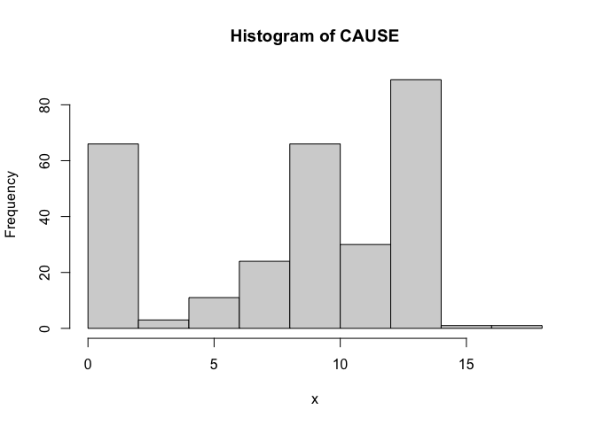
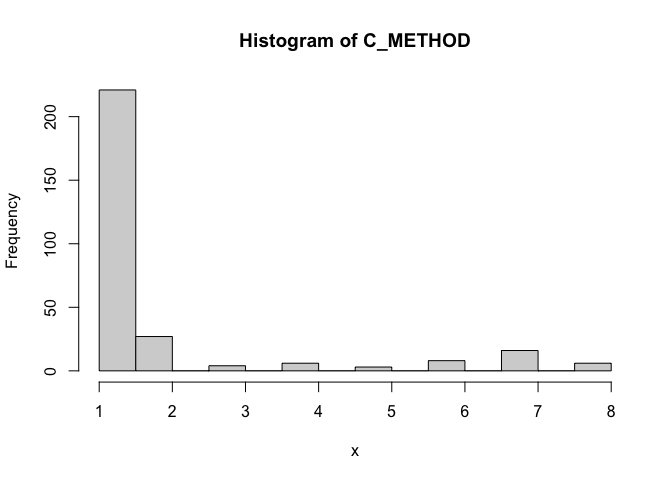
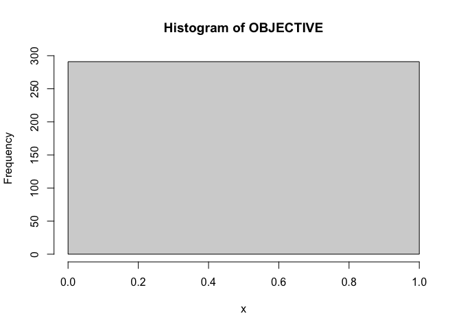
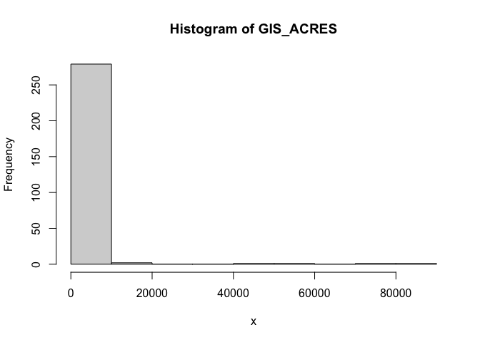
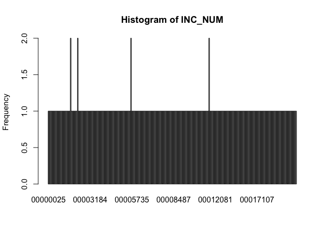

Exploratory Data Analysis: Air Quality System (AQS)
================

United States Environmental Protection Agency: Air Quality System (AQS)

------------------------------------------------------------------------

**Data Summary**

## **AQS Summary**

`523,025` rows

`18,300` rows with missing values

| Variable | Mean | Min | P25 | Median | P75 | Max | NA_Count | NA_Percentage |
|:--:|:--:|:--:|:--:|:--:|:--:|:--:|:--:|:--:|
| state_code | 6.00 | 6.00 | 6.00 | 6.00 | 6.00 | 6.00 | 0 |  |
| county_code | 56.17 | 1.00 | 13.00 | 67.00 | 85.00 | 99.00 | 0 |  |
| site_number | 424.08 | 1.00 | 4.00 | 7.00 | 1,001.00 | 5,003.00 | 0 |  |
| poc | 2.99 | 1.00 | 3.00 | 3.00 | 3.00 | 4.00 | 0 |  |
| pm25 | 9.18 | -10.00 | 4.00 | 7.00 | 11.00 | 634.00 | 18,300 | 3% |
| latitude | 37.89 | 36.69 | 37.49 | 37.86 | 38.10 | 39.23 | 0 |  |
| longitude | -121.89 | -123.21 | -122.28 | -121.99 | -121.27 | -120.84 | 0 |  |

numeric

| Variable | N_Unique | Min_Char | Max_Char | Top_Counts | NA_Count | NA_Percentage |
|:--:|:--:|:--:|:--:|:--:|:--:|:--:|
| timestamp | 17,520 | 16 | 16 | 2019-01-01 00:00: 34, 2019-01-01 01:00: 34, 2019-01-01 02:00: 34 | 0 |  |
| id | 32 | 11 | 11 | 06_077_1002: 35040, 06_095_0004: 34826, 06_067_0012: 27696 | 0 |  |

character

------------------------------------------------------------------------

Histograms for numerical columns
<!-- --><!-- --><!-- --><!-- --><!-- --><!-- -->

Bar Plots for categorical columns

<!-- --><!-- --><!-- --><!-- --><!-- --><!-- -->
