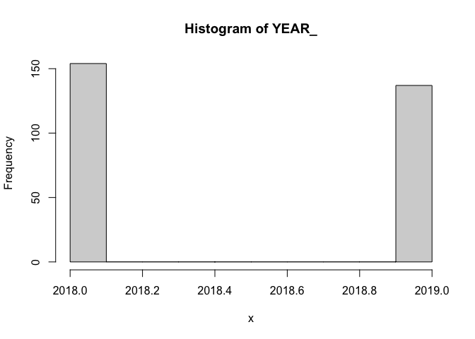
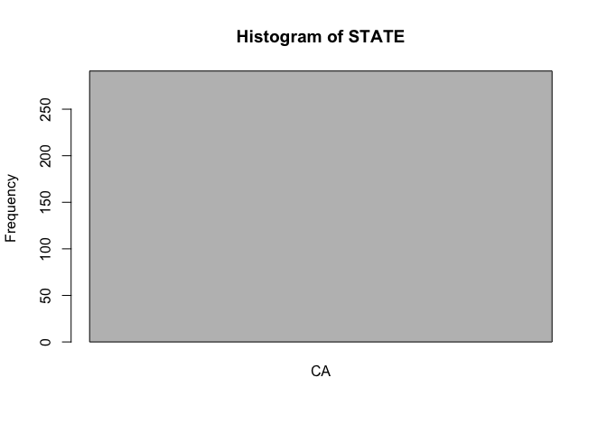

Exploratory Data Analysis: Weather Data
================

------------------------------------------------------------------------

**Data Summary**

## **Weather Summary**

`588,075` rows

`513,500` rows with missing values

| Variable | Mean | Min | P25 | Median | P75 | Max | NA_Count | NA_Percentage |
|:--:|:--:|:--:|:--:|:--:|:--:|:--:|:--:|:--:|
| temp_fahrenheit | 59.84 | 0.00 | 51.00 | 57.92 | 67.40 | 147.20 | 9,514 | 2% |
| rel_humidity | 65.60 | 2.48 | 47.99 | 69.14 | 85.28 | 107.07 | 11,860 | 2% |
| wind_direction | 164.53 | 0.00 | 70.67 | 165.00 | 258.00 | 360.00 | 5,113 | 1% |
| wind_speed | 5.52 | 0.00 | 2.00 | 4.85 | 8.00 | 152.00 | 1,216 | 0% |
| wind_gust | 18.32 | 8.00 | 15.00 | 17.50 | 20.50 | 160.00 | 512,330 | 87% |
| lon | -121.80 | -123.20 | -122.22 | -121.79 | -121.41 | -120.75 | 0 |  |
| lat | 38.12 | 36.89 | 37.63 | 38.21 | 38.67 | 39.22 | 0 |  |

numeric

| Variable | N_Unique | Min_Char | Max_Char | Top_Counts | NA_Count | NA_Percentage |
|:--:|:--:|:--:|:--:|:--:|:--:|:--:|
| station | 37 | 3 | 3 | OAK: 17492, SCK: 17492, SFO: 17492 | 0 |  |
| timestamp | 17,496 | 19 | 19 | 2018-11-05 20:00:00: 37, 2018-11-05 21:00:00: 37, 2018-11-06 03:00:00: 37 | 0 |  |

character

------------------------------------------------------------------------

Histograms for numerical columns

<!-- --><!-- --><!-- --><!-- --><!-- -->

Bar Plots for categorical columns

<!-- -->
