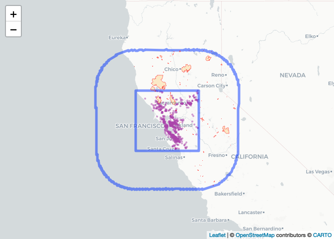
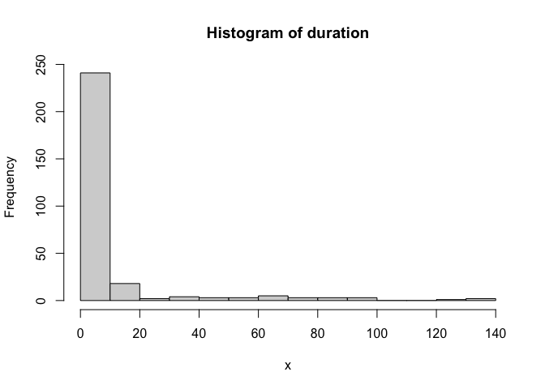

Exploratory Data Analysis: Weather Data
================

``` r
# drop unnecessary columns
wildfires_df <- wildfires_df %>% select(-COMMENTS, -COMPLEX_NA, -FIRE_NUM, -COMPLEX_ID, -IRWINID)
```

<!-- -->

    ##   YEAR_ STATE AGENCY UNIT_ID FIRE_NAME  INC_NUM ALARM_DATE  CONT_DATE CAUSE
    ## 1  2019    CA    USF     STF   ROSASCO 00001355 2019-05-23 2019-12-02     9
    ## 2  2018    CA    USF     TNF     NORTH 00001355 2018-09-03 2018-10-17     4
    ##   C_METHOD OBJECTIVE GIS_ACRES DECADES fire_id duration
    ## 1        6         1    732.40    2010    1765      193
    ## 2        1         1   1119.77    2010    2133       44

------------------------------------------------------------------------

**Data Summary**

## **Wildfire Summary**

`291` rows

`7` rows with missing values

| Variable  |   Mean   | Min  |  P25  | Median |  P75   |   Max   | NA_Count | NA_Percentage |
|:---------:|:--------:|:----:|:-----:|:------:|:------:|:-------:|:--------:|:-------------:|
| GIS_ACRES | 3,649.06 | 0.41 | 13.33 | 52.66  | 235.64 | 410,202 |    0     |               |
| duration  |  11.25   | 0.00 | 0.00  |  1.00  |  4.00  |   365   |    0     |               |

numeric

| Variable | N_Unique | Min_Char | Max_Char | Top_Counts | NA_Count | NA_Percentage |
|:--:|:--:|:--:|:--:|:--:|:--:|:--:|
| STATE | 1 | 2 | 2 | CA: 291 | 0 |  |
| AGENCY | 7 | 3 | 3 | CDF: 226, USF: 36, LRA: 10 | 0 |  |
| UNIT_ID | 41 | 3 | 3 | BEU: 34, LNU: 30, FKU: 27 | 0 |  |
| FIRE_NAME | 261 | 3 | 17 | HUNTER: 3, LAKE: 3, OAK: 3 | 0 |  |
| INC_NUM | 281 | 7 | 8 | 00001355: 2, 00001925: 2, 00005561: 2 | 7 | 2% |
| YEAR\_ | 2 | 4 | 4 | 2018: 154, 2019: 137 | 0 |  |
| CAUSE | 13 | 1 | 2 | 14: 89, 2: 45, 9: 39 | 0 |  |
| C_METHOD | 8 | 1 | 1 | 1: 221, 2: 27, 7: 16 | 0 |  |
| OBJECTIVE | 1 | 1 | 1 | 1: 291 | 0 |  |
| DECADES | 1 | 4 | 4 | 2010: 291 | 0 |  |
| fire_id | 291 | 4 | 4 | 1489: 1, 1490: 1, 1506: 1 | 0 |  |

character

|  Variable  |    Min     |    Max     |   Median   | N_Unique | NA_Count | NA_Percentage |
|:----------:|:----------:|:----------:|:----------:|:--------:|:--------:|:-------------:|
| ALARM_DATE | 2018-02-11 | 2019-12-19 | 2018-10-15 |   187    |    0     |               |
| CONT_DATE  | 2018-02-11 | 2020-01-28 | 2018-11-13 |   200    |    0     |               |

date

------------------------------------------------------------------------

Histograms for numerical columns

<!-- --><!-- --><!-- --><!-- --><!-- --><!-- --><!-- --><!-- -->

Bar Plots for categorical columns

<!-- --><!-- --><!-- --><!-- --><!-- --><!-- --><!-- -->

<!-- # ```{r} -->
<!-- # # purpleair_data %>% select(time_stamp, sensor_index) %>% head() -->
<!-- # # wildfires_purpleair %>% head() -->
<!-- # ``` -->
<!-- #  -->
<!-- # ```{r} -->
<!-- # fire_ids <- wildfires_purpleair %>% pull(fire_id) %>% unique() -->
<!-- # wildfires_df <- wildfires_df %>% filter(fire_id %in% fire_ids) -->
<!-- # fire_sf <- fire_sf %>% filter(fire_id %in% fire_ids) -->
<!-- # ``` -->
<!-- #  -->
<!-- # ```{r} -->
<!-- # wildfires_df <- wildfires_df %>% mutate( -->
<!-- # discovery_date = ymd(ALARM_DATE), -->
<!-- # containment_date = ymd(CONT_DATE) -->
<!-- # ) %>% select(fire_id, discovery_date, containment_date, GIS_ACRES) -->
<!-- #  -->
<!-- # library(tidyr) -->
<!-- #  -->
<!-- # wildfires_expanded <- wildfires_df %>% -->
<!-- # rowwise() %>% -->
<!-- # mutate(date = if (discovery_date < containment_date) list(discovery_date, containment_date) else list(seq.Date(discovery_date, containment_date, by = "day"))) -->
<!-- #  -->
<!-- # # %>% -->
<!-- #  -->
<!-- # # mutate(date = list(seq.Date(start_date, end_date, by = "day"))) %>% -->
<!-- # unnest(date) %>% -->
<!-- # select(fire_id, date, GIS_ACRES) -->
<!-- #  -->
<!-- #  -->
<!-- # wildfires_df -->
<!-- #  -->
<!-- # # fire_id, GIS_ACRES -->
<!-- #  -->
<!-- # # Most basic bubble plot -->
<!-- # p <- ggplot(wildfires, aes(x=ALARM_DATE, y=GIS_ACRES)) + -->
<!-- # geom_line() +  -->
<!-- # xlab("") -->
<!-- # p -->
<!-- # ``` -->
<!-- #  -->
<!-- # ```{r} -->
<!-- # img_path <- file.path("../docs", "plots", "pa-fire-map.png") -->
<!-- # if (!file.exists(img_path)) { -->
<!-- # map_path <- file.path("../docs", "maps", "pa-fire-map.html") -->
<!-- # m <- leaflet() %>% -->
<!-- # addCircleMarkers(data = pa_sf, popup = ~as.character(sensor_index), label = ~as.character(sensor_index), -->
<!-- # fillColor = "#AA44AA", fillOpacity = 0.5, weight = 0, radius = 2) %>% -->
<!-- # addPolygons(data = fire_sf,  -->
<!-- # popup = ~paste("fire_id:", fire_id), -->
<!-- # label = ~paste("fire_id:", fire_id), -->
<!-- # color = "red", opacity = 0.5, weight = 1, -->
<!-- # fillColor = "orange", fillOpacity = 0.2) %>% -->
<!-- # addProviderTiles("CartoDB") -->
<!-- # saveWidget(m, file = map_path) -->
<!-- # webshot(map_path, file = img_path) -->
<!-- # } -->
<!-- #  -->
<!-- # knitr::include_graphics(img_path) -->
<!-- # ``` -->
<!-- #  -->
<!-- # ```{r} -->
<!-- # # Create a sequence of dates between ALARM_DATE and CONT_DATE for each fire -->
<!-- # fire_active_days <- wildfires %>% -->
<!-- #   filter(!is.na(ALARM_DATE) & !is.na(CONT_DATE)) %>% -->
<!-- #   mutate(active_period = map2(ALARM_DATE, CONT_DATE, seq, by = "day")) %>% -->
<!-- #   unnest(active_period) -->
<!-- #  -->
<!-- # # Count number of fires active per day -->
<!-- # fires_per_day <- fire_active_days %>% -->
<!-- #   group_by(active_period) %>% -->
<!-- #   summarise(count = n()) -->
<!-- #  -->
<!-- # # Plot active fires over time -->
<!-- # ggplot(fires_per_day, aes(x = active_period, y = count)) + -->
<!-- #   geom_line() + -->
<!-- #   labs(title = "Number of Active Wildfires Over Time", x = "Date", y = "Number of Active Wildfires") + -->
<!-- #   theme_minimal() -->
<!-- #  -->
<!-- # ``` -->
<!-- #  -->
<!-- # ```{r} -->
<!-- # img_path <- file.path("../docs", "plots", "pa-fire-map.png") -->
<!-- # if (!file.exists(img_path)) { -->
<!-- #   map_path <- file.path("../docs", "maps", "pa-fire-map.html") -->
<!-- #   m <- leaflet() %>% -->
<!-- #     addCircleMarkers(data = pa_sf, popup = ~as.character(sensor_index), label = ~as.character(sensor_index), -->
<!-- #                      fillColor = "#AA44AA", fillOpacity = 0.5, weight = 0, radius = 5) %>% -->
<!-- #     addPolygons(data = fire,  -->
<!-- #                 # popup = ~paste("sensor_index:", sensor_index),  -->
<!-- #                 # label = ~paste("sensor_index:", sensor_index), -->
<!-- #                 color = "red", opacity = 0.5, weight = 1, -->
<!-- #                 fillColor = "orange", fillOpacity = 0.2) %>% -->
<!-- #     addProviderTiles("CartoDB") -->
<!-- #   saveWidget(m, file = map_path) -->
<!-- #   webshot(map_path, file = img_path) -->
<!-- # } -->
<!-- #  -->
<!-- # knitr::include_graphics(img_path) -->
<!-- # ``` -->
<!-- #  -->
<!-- # # FIRE CALCULATION -->
<!-- # ```{r} -->
<!-- # # Create a combined score based on distance and recency -->
<!-- # fire_impact <- purpleair_fires_df %>% -->
<!-- #   mutate( -->
<!-- #     recency_weight = 1 + max(0, fire_days1 - fire_days2), -->
<!-- #     distance_weight = 1 / fire_distance, -->
<!-- #     impact_score = recency_weight * distance_weight -->
<!-- #   ) %>% -->
<!-- #   group_by(sensor_index, sensor_date) %>% -->
<!-- #   slice_max(impact_score)  # Keep fire with highest impact score for each sensor and date -->
<!-- #  -->
<!-- # ``` -->
