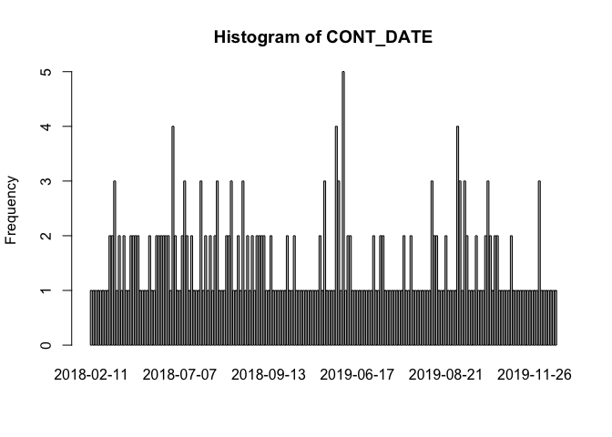
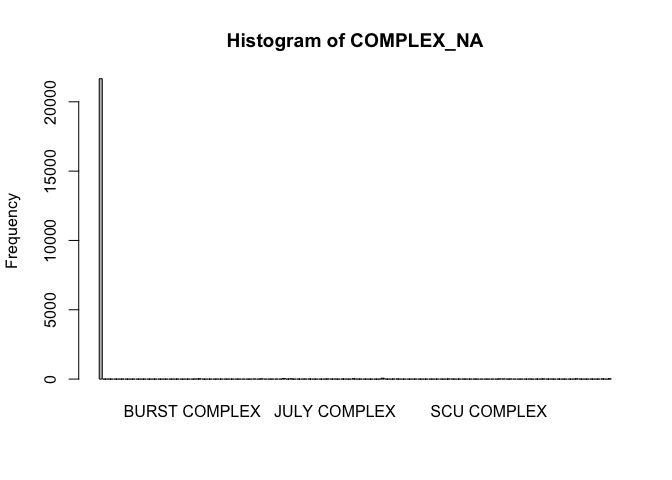

Exploratory Data Analysis: Weather Data
================

------------------------------------------------------------------------

**Data Summary**

## **Wildfire Summary**

`22,261` rows

`0` rows with missing values

| Variable | Mean | Min | P25 | Median | P75 | Max | NA_Count | NA_Percentage |
|:--:|:--:|:--:|:--:|:--:|:--:|:--:|:--:|:--:|
| YEAR\_ | 1,970.89 | 0 | 1,951.00 | 1,983.0 | 2,008.00 | 2,023 | 0 |  |
| CAUSE | 9.25 | 0 | 4.00 | 10.0 | 14.00 | 19 | 0 |  |
| C_METHOD | 2.00 | 0 | 0.00 | 0.0 | 3.00 | 8 | 0 |  |
| OBJECTIVE | 1.00 | 0 | 1.00 | 1.0 | 1.00 | 2 | 0 |  |
| GIS_ACRES | 1,937.38 | 0 | 27.14 | 148.6 | 621.01 | 1,032,700 | 0 |  |
| DECADES | 1,966.36 | 0 | 1,950.00 | 1,980.0 | 2,000.00 | 2,020 | 0 |  |
| fire_id | 11,131.00 | 1 | 5,566.00 | 11,131.0 | 16,696.00 | 22,261 | 0 |  |

numeric

| Variable | N_Unique | Min_Char | Max_Char | Top_Counts | NA_Count | NA_Percentage |
|:--:|:--:|:--:|:--:|:--:|:--:|:--:|
| STATE | 4 | 2 | 2 | CA: 22245, NV: 10, OR: 4 | 0 |  |
| AGENCY | 11 | 0 | 3 | USF: 9638, CDF: 7010, CCO: 3385 | 0 |  |
| UNIT_ID | 110 | 0 | 3 | LAC: 2025, CNF: 1022, SRF: 984 | 0 |  |
| FIRE_NAME | 9,109 | 0 | 30 | : 6589, UKNOWN: 87, N/A: 72 | 0 |  |
| INC_NUM | 7,131 | 0 | 8 | 00000000: 12515, : 975, 00312031: 27 | 0 |  |
| COMMENTS | 1,637 | 0 | 95 | : 19554, 20090305: 420, 1917-34(Yr Not Report)MarinCo FireChief Garber Map: 68 | 0 |  |
| COMPLEX_NA | 140 | 0 | 32 | : 21665, MENDOCINO LIGHTNING COMPLEX: 62, GRINDSTONE COMPLEX: 38 | 0 |  |
| IRWINID | 2,677 | 0 | 40 | : 19566, {1FE0DBA3-802B-4D0A-B4F7-D0A5BBFF1D7B}: 5, {36388BE6-16C8-4DB1-8A0F-694429AC7633}: 4 | 0 |  |
| FIRE_NUM | 3,172 | 0 | 8 | : 5114, 00000000: 3621, 00000001: 267 | 0 |  |
| COMPLEX_ID | 93 | 0 | 38 | : 21901, 00004608: 46, 00000934: 36 | 0 |  |

character

|  Variable  |    Min     |    Max     |   Median   | N_Unique | NA_Count | NA_Percentage |
|:----------:|:----------:|:----------:|:----------:|:--------:|:--------:|:-------------:|
| ALARM_DATE | 0219-05-29 | 2023-12-22 | 1981-01-21 |  8,779   |    0     |               |
| CONT_DATE  | 0219-05-29 | 2024-01-09 | 1899-12-30 |  5,292   |    0     |               |

date

------------------------------------------------------------------------

Histograms for numerical columns
<!-- --><!-- --><!-- --><!-- --><!-- --><!-- --><!-- -->

Bar Plots for categorical columns

<!-- --><!-- --><!-- --><!-- --><!-- --><!-- --><!-- --><!-- --><!-- --><!-- --><!-- --><!-- -->

<!-- # FIRE CALCULATION -->
<!-- ```{r} -->
<!-- # Create a combined score based on distance and recency -->
<!-- fire_impact <- purpleair_fires_df %>% -->
<!--   mutate( -->
<!--     recency_weight = 1 + max(0, fire_days1 - fire_days2), -->
<!--     distance_weight = 1 / fire_distance, -->
<!--     impact_score = recency_weight * distance_weight -->
<!--   ) %>% -->
<!--   group_by(sensor_index, sensor_date) %>% -->
<!--   slice_max(impact_score)  # Keep fire with highest impact score for each sensor and date -->
<!-- ``` -->
